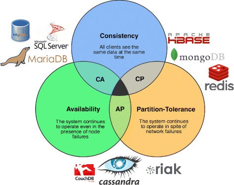
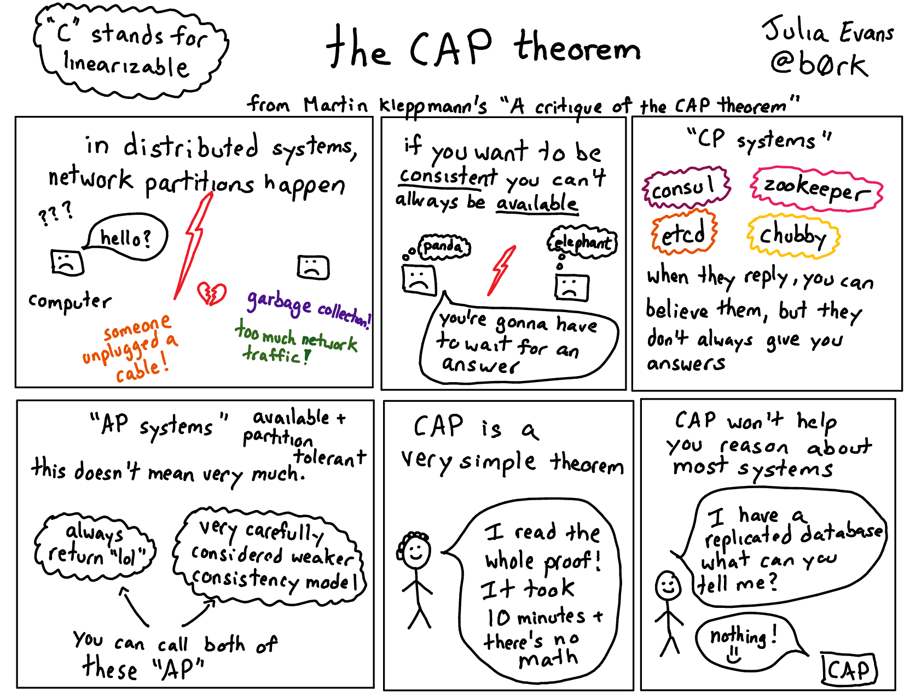
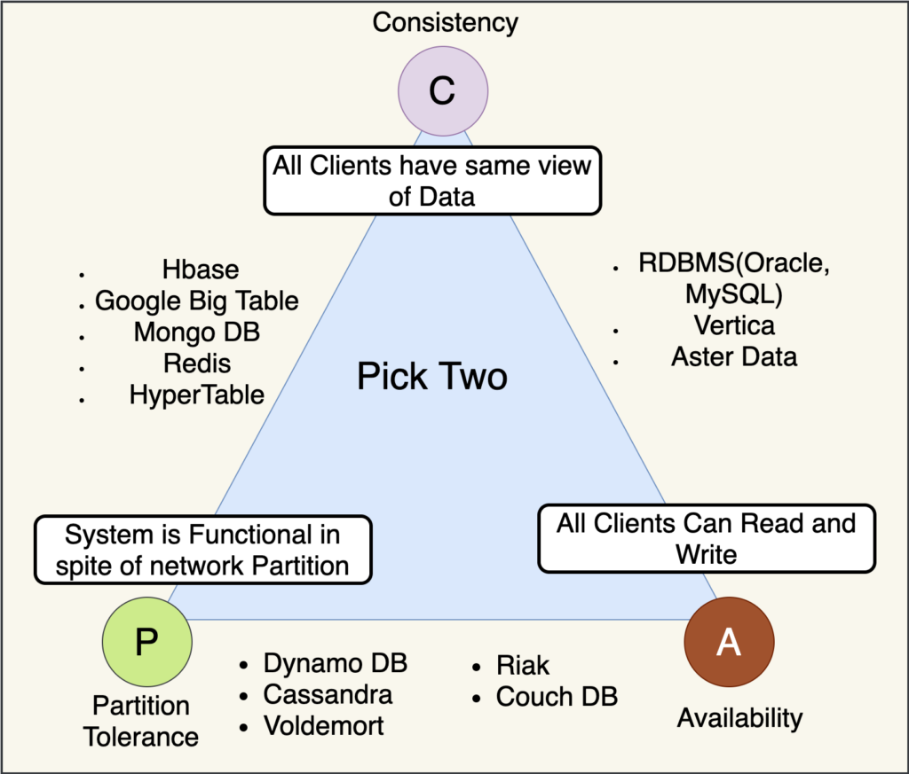
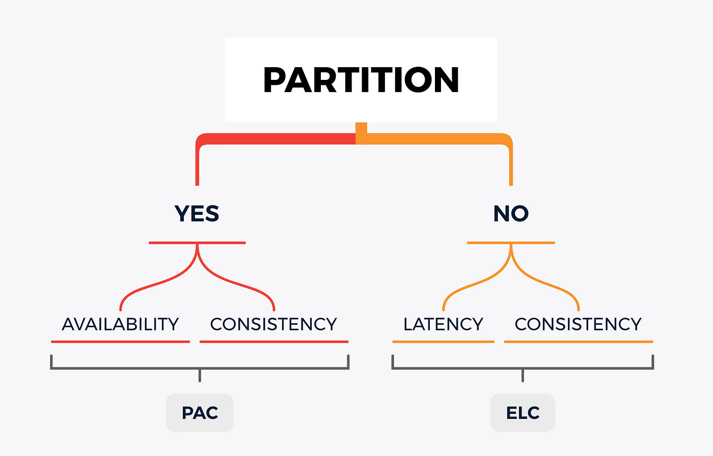
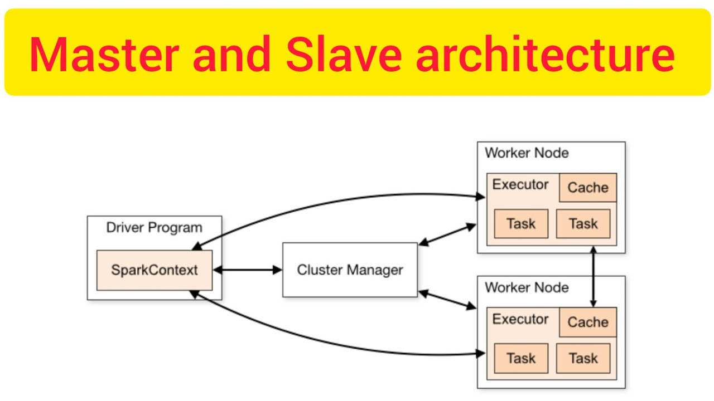
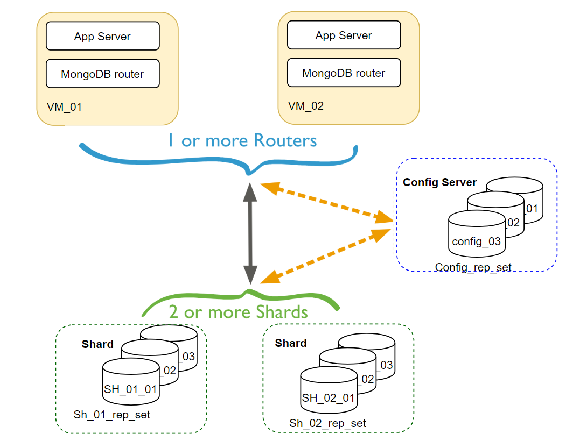

## CAP Theorem

CAP Theorem:
The CAP theorem states that a distributed system can only provide two of three properties simultaneously: 
**Consistency, Availability, and Partition tolerance**.

Let’s take a real-life example; say a person named Rohit decides to start a company, “reminder”, where people can call him and ask him to put the reminder, 
and whenever they call him back to get the reminder, he will tell them their reminders.

For this, Rohit has taken an easy phone number as well, 123456.
Now his business has started flourishing, and he gets a lot of requests, and he notes reminders in the diary.

After a while, this process becomes hectic for Rohit alone, because he can only take one call at a time, and there are multiple calls waiting.
Now, Rohit hires someone called “Raj”, and both manage the business.

One day, Rohit gets a call from a person named “X” asking him the time of his flight, 
But Rohit was not able to get any entry for X. So, he says that he doesn't have a flight, but unfortunately, that person has that flight,
and he missed it because of Rohit.
The problem is when person “X” called for the first time, the call went to “Raj”, so Raj had the entry, but Rohit didn’t.
They have two different stores, and they are not in sync.

#### Problem 1: Inconsistency
It’s a situation where different data is present at two different machines.

Solution 1:
Whenever a write request comes, both of them write the entry and then return success. In this case, both are consistent.

#### Problem 2: Availability problem.
Now one day, Raj is not there in the office, and a request comes. So because of the previous rule, only when both of them write the entry then only they will return success. Therefore the question is How to return the success now.

Solution 2:
When the other person is not there to take the entry, then also we will take the entries, but the next day, before resuming, the other person has to ensure they catch up on all entries before marking themselves as active (before starting to take calls).

#### Problem 3: Network Partition:
Imagine someday both Raj and Rohit have a fight and stop talking to each other. 
Now, if a person X calls Raj to take down a reminder, what should Raj do? 

Raj cannot tell Rohit to also note down the entry, because they are not talking to each other.
If Raj notes the reminder and returns success to X, then there is an inconsistency issue.
[X calls back and the call goes to Rohit who does not have the entry].
If Raj refuses to note the reminder and returns failure to stay consistent, then it’s an availability issue. 
Till Raj and Rohit are not talking to each other, all new reminder requests will fail.

Hence, if there are 2 machines storing the same information but if a network partition happens between them then there is no choice but to choose between Consistency and Availability.

## PACELC Theorem:

In the case of network partitioning (P) in a distributed computer system, one has to choose between availability (A) and consistency (C).
But else (E), even when the system is running normally in the absence of partitions, one has to choose between latency (L) and consistency (C).
Latency is the time taken to process the request and return a response.

So If there is no network partition, we have to choose between extremely low Latency or High consistency. They both compete with each other.

Some Examples of When to choose between Consistency and Availability.

In a banking system, **Consistency** is important. so we want immediate consistency
but in reality, ATM transactions (and a lot of other banking systems) use eventual consistency

In a Facebook news feed-like system, availability is more important than the consistency.
For Quora, Availability is more important.
For Facebook Messenger, Consistency is even more important than availability because miscommunication can lead to disturbance in human relations.

## Master Slave System:

In Master-Slave systems, Exactly one machine is marked as Master, and the rest are called Slaves.

Master Slave systems that are Highly Available and not eventually consistent.

Steps:
Master system takes the write.
If the write is successful, return success.

Try to sync between slave1 and slave2.
Example: Splunk, where we have a lot of logs statements now, there is so much throughput coming in, 
    we just want to process the logs even if we miss some logs, it’s ok.

      2. Master-Slave systems that are Highly Available and eventually consistent:

Steps: 
1. The Master system takes to write, and if one slave writes, then success is returned.
2. All slaves sync.

Example:   Computing news feed and storing posts, there we don’t want the post to be lost; they could be delayed but eventually sync up.

      3.  Master Slave that are Highly Consistent:

           Steps:
Master and all slave take the writes, if all have written, then only return success.
Example: The banking system.

In Master-Slave systems,
All writes first come to Master only.
Reads can go to any of the machines.
Whenever the Master system dies, a new election of the master will take place based on a different elections algorithm.

### Drawbacks of Master-Slave System:
A single master can become the bottleneck when there are too many writes.
In highly consistent systems, slaves increase which increases the rate of failure and latency also increases.

For example, For highly consistent systems, if there are 1000 slaves, the Master-slave system will not work. 
We have to do more sharding. 

