## Decoupling of App server nad Db

In LoadBalancer, we learned that when we type something on the browser( or search for a website specifically), 
the first thing browser has to do is talk to a DNS and figure out which IP address the browser should be talking to, 
and it communicates with the machine at that particular IP. 
And when you go from one machine to multiple machines, you need a load balancer to distribute traffic uniformly, 
but after a point when the amount of information cannot fit into a single machine, then the model needs to shard. 
It can be done using consistent hashing.
However, the machines had both the code and storage in the previous model. _Do you think it is a good model_????

1. Code and database are tightly coupled, and code deployments cause unavailability.
2. Fewer resources are available for the code since the database will also use some of the resources.

So it is better to decouple code and storage. 
However, the only downside of decoupling is the additional latency of going from one machine to another (code to the database).

So it can be concluded that it is not ideal for storing code and database on the same machine. 
The approach is to separate the code and storage parts to increase efficiency.

Different machines storing the same code running simultaneously are called Application Server Machines or App Servers. 
Since they don't store data and only have code parts, they are stateless and easily scalable machines.

------------------------------------------------------------------------------------------------------------------------

## Caching

**The process of storing things closer to you or in a faster storage system so that you can get them very fast can be termed caching.**
Caching happens at different places. 
### 1. In- Browser Caching
    We can cache some IPs so that browser doesn't need to communicate with the DNS server every time to get the same IP address. 
    This caching is done of smaller entries that are likely not to change very often and is called in-browser caching. 
    Browser caches DNS and static information like images, videos, and JavaScript files. 
    This is why a website takes time to load for the first time but loads quickly because the browser caches the information.

### 2. CDN ( Content Delivery Network)

You have the browser in some region(say India), and you must fetch the files from the servers located in another region(say the US). 

    When you try to access from your browser -> a request is made to the load balancer -> application server ->  file storage. 

    You know that transferring files and other data will be fast for the machines in the same region. 
    But it can take time for machines located on different continents.

From the website perspective, users worldwide should have a good experience, and these separate regions act as a hindrance. 
So what’s the solution?

The solution for the problem is _**CDN, Continent Delivery Network**_. Examples of CDN are companies like

1. Akamai
2. Cloudflare
3. CloudFront by Amazon
4. Fastly

These companies' primary job is to have machines worldwide, in every region. 
They store your data, distribute it to all the regions, 
and provide different CDN links to access data in a particular region. 

Suppose you are requesting data from the US region. 
Obviously, you can receive the HTML part/ code part quickly since it is much smaller than the multimedia images. 
For multimedia, you will get CDN links to files of your nearest region. 
Accessing these files from the nearest region happens at a much larger pace. 

**Also, you pay per use for using these CDN services.**

One question : how your machine talks to the nearest region only(gets its IP, not of some machine located in another region), 
when CDN has links for all the regions. Well, this happens in two ways:

1. A lot of ISP have CDN integrations. Tight coupling with them helps in giving access to the nearest IP address. For example, Netflix’s CDN does that.
2. Anycast (https://www.cloudflare.com/en-gb/learning/cdn/glossary/anycast-network/)

This CDN process to get information from the nearest machine is also a form of caching.

### 3. Local Caching
It is caching done on the application server so that we don't have to hit the database repeatedly to access data.

### 4. Global Caching

This is also termed In-memory caching.
In practice, systems like Redis and Memcache help to fetch actual or derived kinds of data quickly.

### Problems Caching brings
1. Cache has limited size
2. It is not the actual source of truth
3. It just stores the replica of original data source (database)
4. Data becomes stale and inconsistent with time -> we constantly need to fetch data after certain interval of time(TTL)
5. Because of limited size, we need to explore eviction policy

### Preventing problems : Caching Invalidation Strategy
One solution that is proposed so that cache doesn’t become stale is : **TTL (Time to Live)**
This strategy can be used if there is no problem with the cache being invalid for a very short time, 
so you can have a periodic refresh. Entries in the cache will be valid for only a period. 
And after that, to again get the entries, you need to fetch them again.
So, for example, if you cache an entry X at timestamp T with TTL of 60 seconds, 
then for all requests asking for entry X within 60 seconds of T, you read directly from cache. 
When you go asking for entry X at timestamp T+61, the entry X is gone and you need to fetch again.

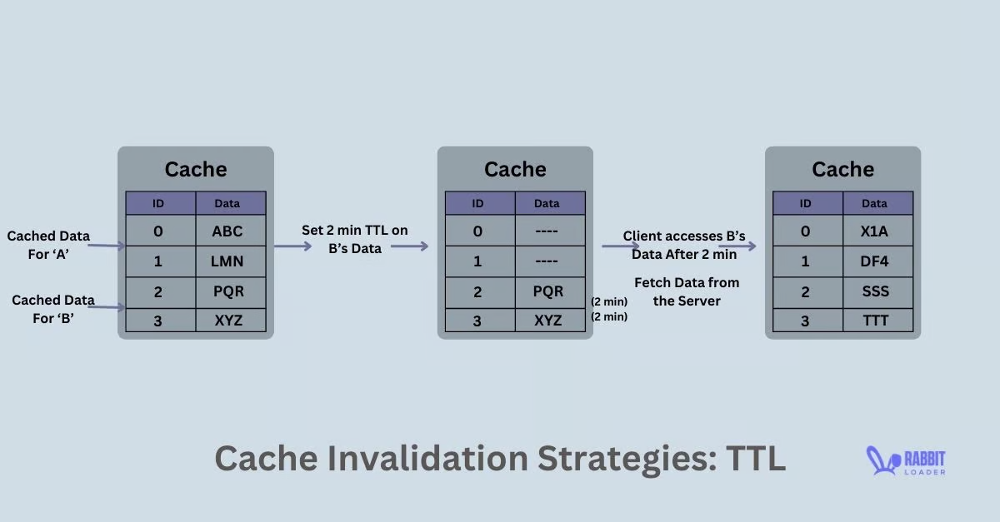

### Keeping cache and DB in sync: 
This can be done by the strategies like Write through cache, Write back cache, or Write around the cache.

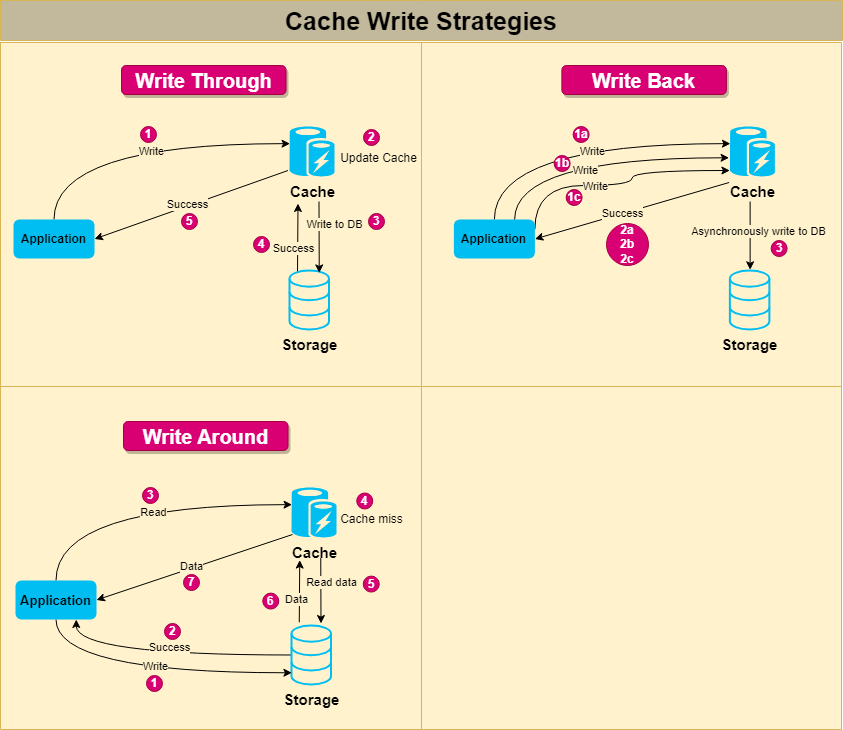

#### Write through cache: 
Anything to be written is database passes from cache first(there can be multiple cache machines), storing it (updating cache), and then updating it to the database and returning success. 
If failed, changes will be reverted in the cache.
It makes the writing slower but reads much faster. For a read-heavy system, this could be a great approach.

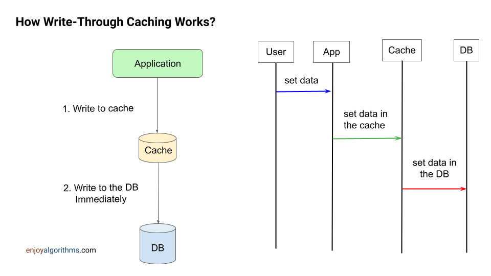

#### Write back cache: 
First, write is written in the cache. 

The moment write in the cache succeeds, you return success to the client. 
Data is then synced to the database asynchronously (without blocking current ongoing request).
The method is preferred where you don't care about the data loss immediately, like in an analytic system where exact data in the DB doesn't matter, 
and analytical trends analysis won't be affected if we lose data or two. 
It is inconsistent, but it will give very high throughput and very low latency.

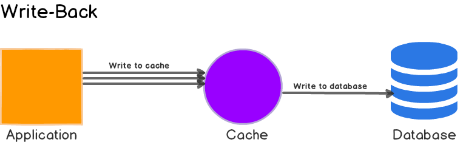

#### Write around cache: 
Here, the writes are done directly in the database, and the cache might be out of sync with the database. 
Hence we can use TTL or any similar mechanism to fetch the data from the database to cache to sync with it.

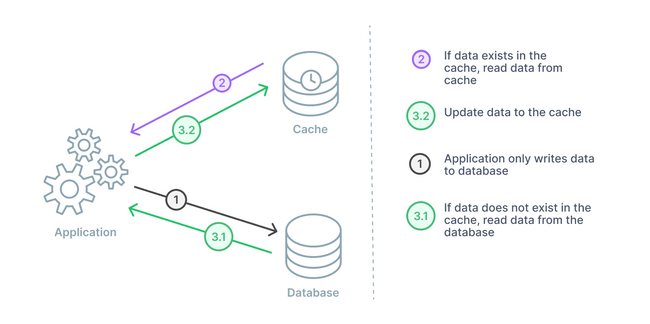

Now let’s talk about the second question: How can you add entries if the cache is full?

Well, for this, you be using an eviction strategy.

### Cache eviction:

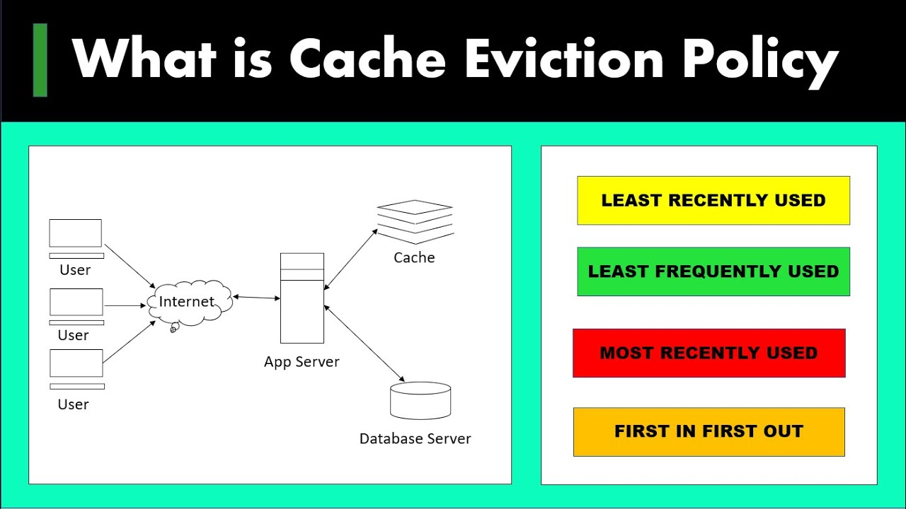

There are various eviction strategies to remove data from the cache to make space for new writes. Some of them are:
FIFO (First In, First Out)

LRU (Least Recently Used):

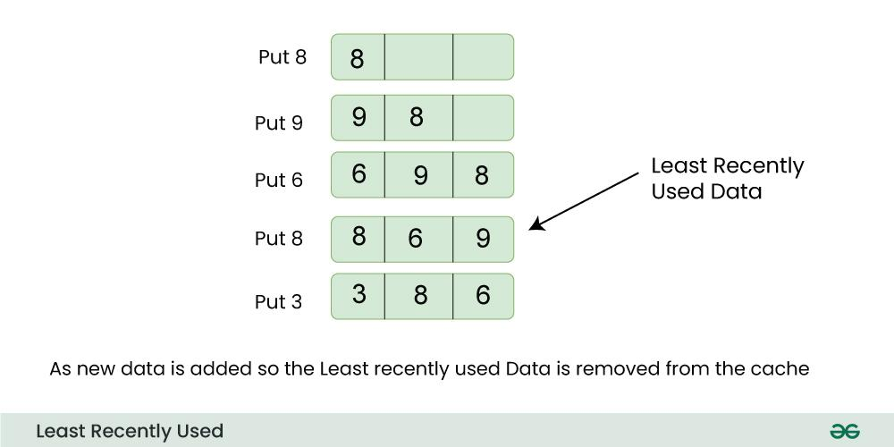

LIFO (Last In, First Out)
MRU (Most Recently Used)

The eviction strategy must be chosen based on the data that is more likely to be accessed. The caching strategy should be designed in such a way that you have a lot of cache hits than a cache miss.

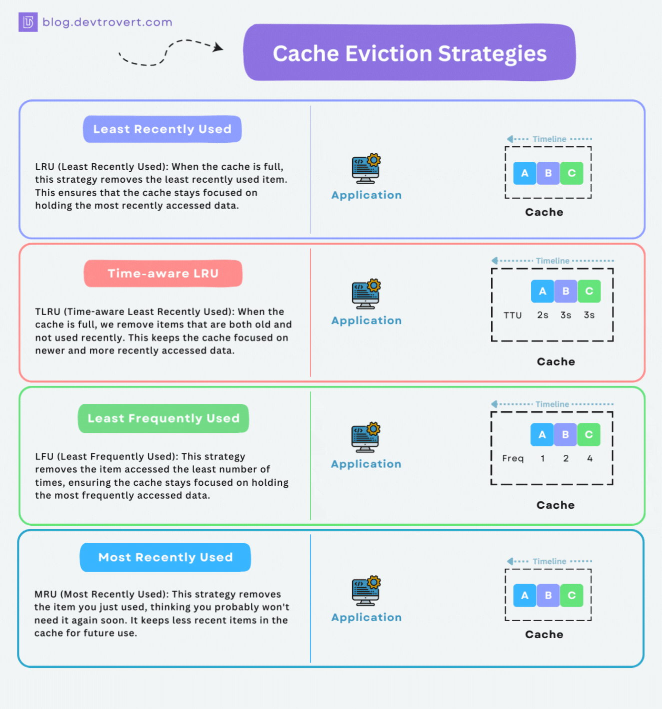

Consider the case of submitting DSA problems on priVerse; 
when you submit a problem on priVerse, the browser talks to priVerse's load balancer. 
And the submission goes to one of the app servers out of many. 
The app server machine gets the user id, problem id, code, and language. 
To execute the code, the machine will need the input file and the expected output file for the given problem. 
The files can be large in size, and it takes time (assumption: around 2 seconds) to fetch files from the file storage. 
This makes code submissions slow.

So, how can you make the process fast?

Assumptions:
If the file is present on the machine itself, on the hard disk, then reading the file from the hard disk takes 40ms.
Reading from a DB machine (MySQL machine), reading a table or a column (not a file) takes around 50ms.

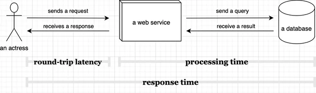

Reading from HDD - 40ms
Reading from Db  - 50ms
It can be noted that input files and the expected output file can be changed. 
The modified changes should be immediately reflected in the code submissions

### Solution : 
1. **TTL Low:** If TTL is very low (say for 1 min), then cache files become invalid on the app server machines after every minute. 
    Hence most of the time, test data won't be available on the machine and is to be fetched from file storage. 
    The number of cache misses will be high for TTL very low\
2. **TTL High**: If TTL is very high, then case invalidation happens too late. 
    Say you keep TTL 60 min, and in between the time you change the input & expected files, the changes will not be reflected instantly

So TTL can be one of the approaches, but it is not a good one. 
**We can choose TTL based on the cache miss rate or cache invalidation rate**

#### Global cache:
Storing the data in a single machine can also be an option, but there are two problems with this:
1. If storing in memory, the remote machine has limited space and can run out of space quickly because the size of the input-output files is very large.
2. The eviction rate will be very high, and the number of cache misses will be more.

#### If instead we store it in the hard disk, 
Then there is the issue of transferring huge amount of data on network.

#### File Metadata
File Metadata
The best approach would be we identify whether the file has changed or not using the metadata for the files.

Let's assume in the MySQL database, there exists table problems_test_data. 
It contains details problem_id, input_filepath, input_file_updated_at, input_file_created_at for input files, and similar details for the output files as well. 

If a file is updated on the file storage, its metadata will also be updated in the SQL database.

Now all the files can be cached in the app server with a better approach to constructing file names. 
The file can be (problem_id)_(updated_at)_input.txt

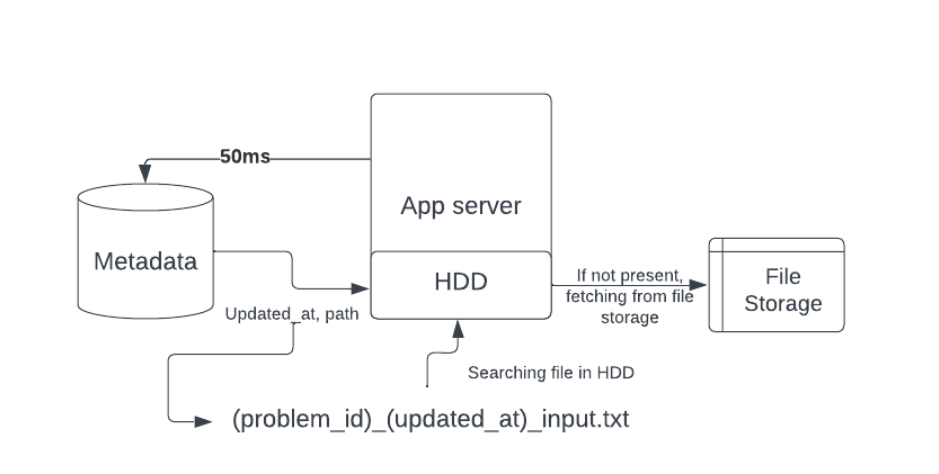

When a submission comes for a problem, we can go to the database (MySQL dB) and get the file path and its last updated time. 

If a file with problem_id_updated_at_input.txt exists in a machine cache, it is guaranteed that the existing file is the correct one. 

If the file doesn't exist, then the path can be used to fetch it from the file storage (along with now storing it locally on the machine for the future). 
Similar things can be done for the output files as well. 

Here the metadata about the file is used to check whether the file has been changed/updated or not, and this gives us a very clean cache invalidation.

#### Updating a file,
All cache servers have some files stored if an update is to be done for a file stored in S3. The process looks like this:
For a problem (say for problem_id 200) if an update request comes to modify an input file to a newly uploaded file.

`   Upload new input file to file storage (S3). It will give a path (say new_path) for the file stored location.
    MySQL DB has to be updated. The query for it looks like
        UPDATE problem_test data WHERE problem_id = 200 SET inputfile_path = new_path AND inputfile_updated_at = NOW()`

Now, if submission comes and the metadata in DB does not match that of the file existing in the cache, 
the new file needs to be fetched from the file storage at the location new_path. 
The returned file will be stored in the HDD of the app server. 
For the next requests, it will be present on the hard disk already (if not evicted).

It can be noted that every time a submission is made, we have to go to the MySQL DB to fetch all the related information of the problem/user. 
The information like whether it's already solved, problem score, and user score. 
It's a better option to fetch the file's metadata simultaneously while we fetch other details. 

If solutions pass, the related details have to be updated on DB again.

A separate cache for all machines is better than **one single-layer cache**. 

-------------------------------------------------------------------------------------------------------------------------------------------------

### Caching Metadata - Global Caching

_Ranklist Discussion_: Let's take an example of the rank list in a contest with immense traffic. 
During the contest, people might be on the problem list page, reading a problem, or on the rank list page (looking for the ranks). 
If scores for the participants are frequently updated, computing the rank list becomes an expensive process (sorting and showing the rank list). 
Whenever a person wants the rank list, it is fetched from DB. This causes a lot of load on the database.

**The solution can be computing the rank list periodically and caching it somewhere for a particular period. 
Copy of static rank list gets generated after a fixed time (say one minute) and cached. 
It reduces the load on DB significantly.**

Storing the rank list in the local server will be less effective since there will be many servers, 
and every minute cache miss may occur for every server. A much better approach is to store the rank list in the global cache shared by all app servers. 
Therefore, there will be only one cache miss every minute. 
Here global caching performs better than local caching. .
Redis can be used for the purpose.

### Redis: 

Redis is one of the most popular caching mechanisms used everywhere. 
It is a single-threaded key-value store. 
The values which Redis supports are:

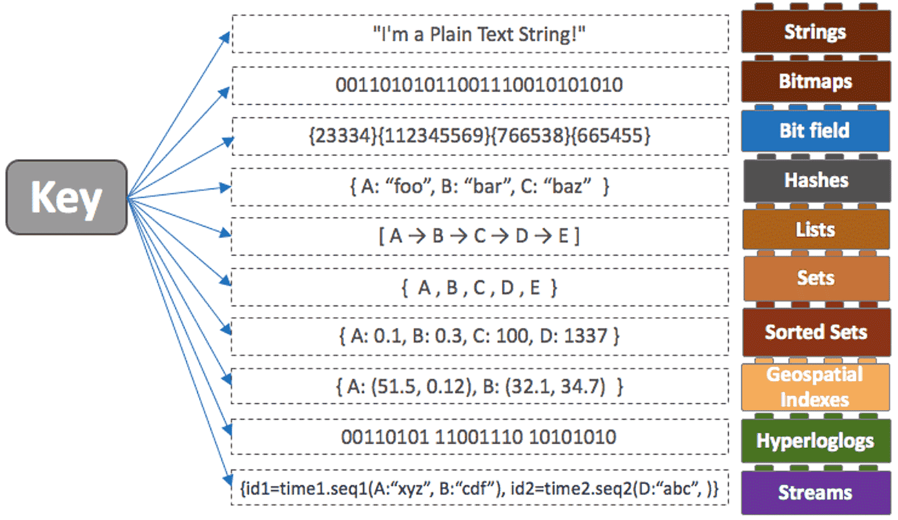

1. String
2. Integer
3. List
4. Set
5. Sorted_set

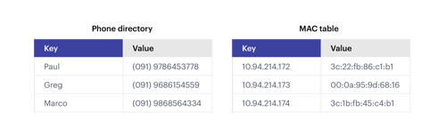

_The main scenarios where global caching is used are_:
> Caching something that is queried often
> Storing derived information, which might be expensive to compute on DB.

And we can use Redis for either of the cases mentioned above to store the most relevant information. 
It is used to decrease data latency and increase throughput.

### Facebook newsfeed :
How do they achieve 

How Facebook computes its newsfeed?
Let’s do another case study. What if we were supposed to build the system that computes news feed for Facebook. Let's first discuss the basic architecture of Facebook.

Facebook has a lot of users, and each user has a bunch of attributes. Let’s first discuss the schema of Facebook if all information could fit on a single machine SQL DB. You can for now assume that we care about the most basic v0 version of Facebook which has no concept of pages/groups/likes/comments, etc

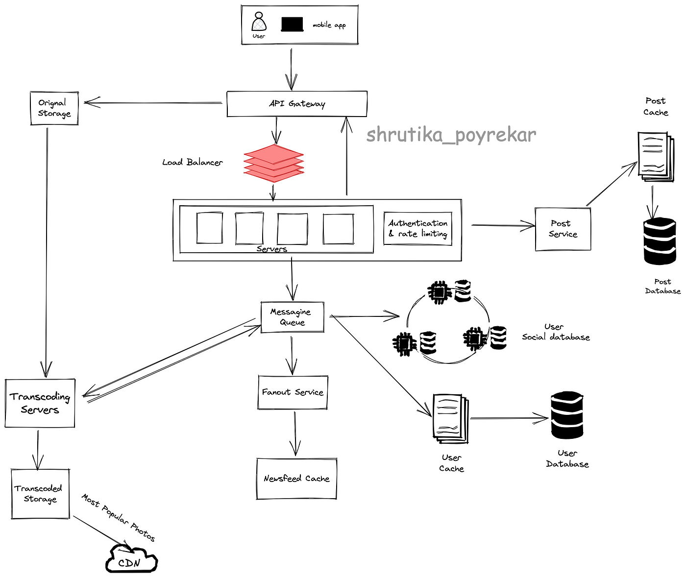

