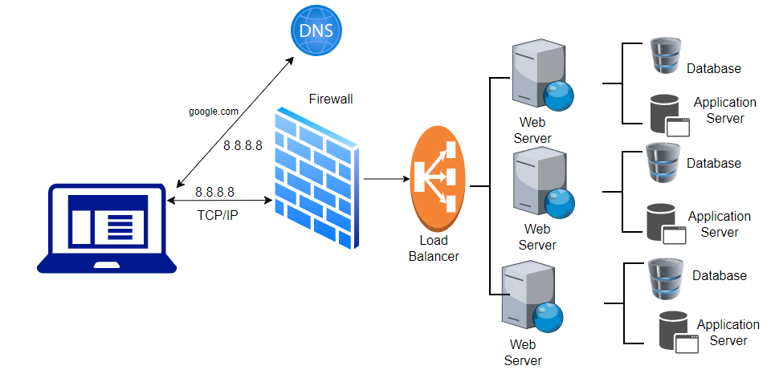
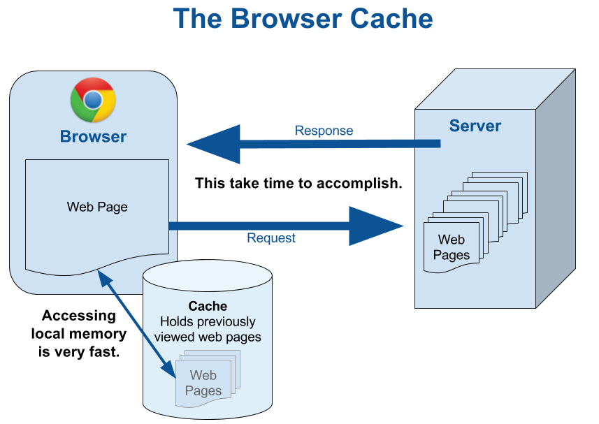
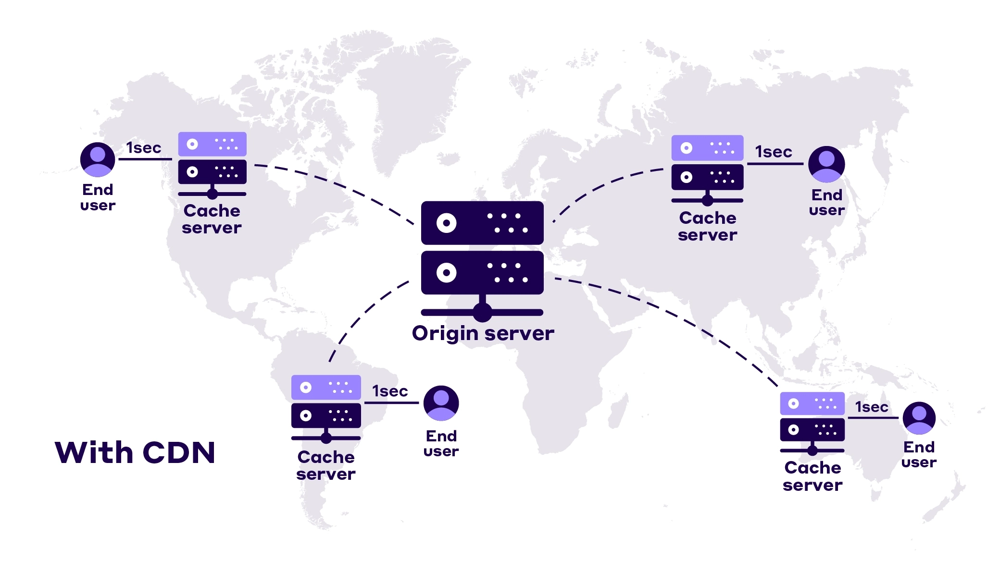
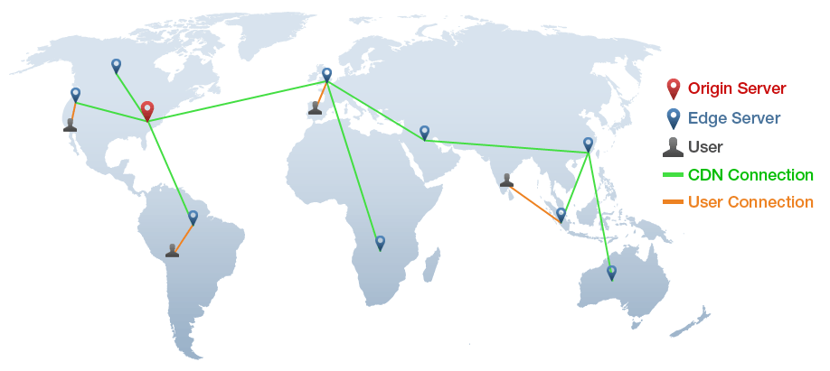
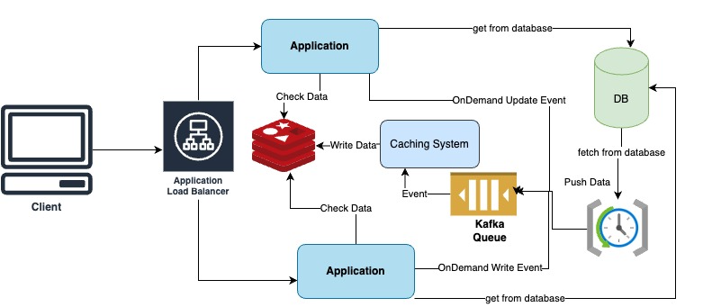
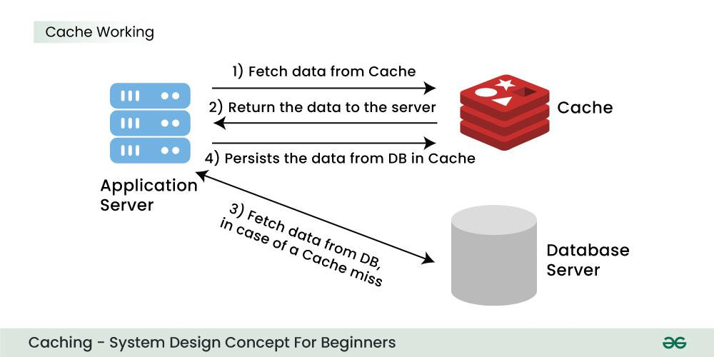
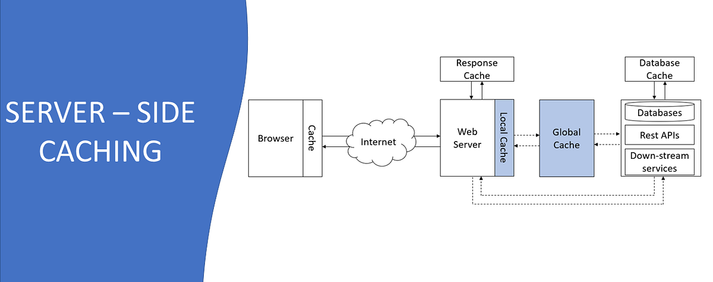
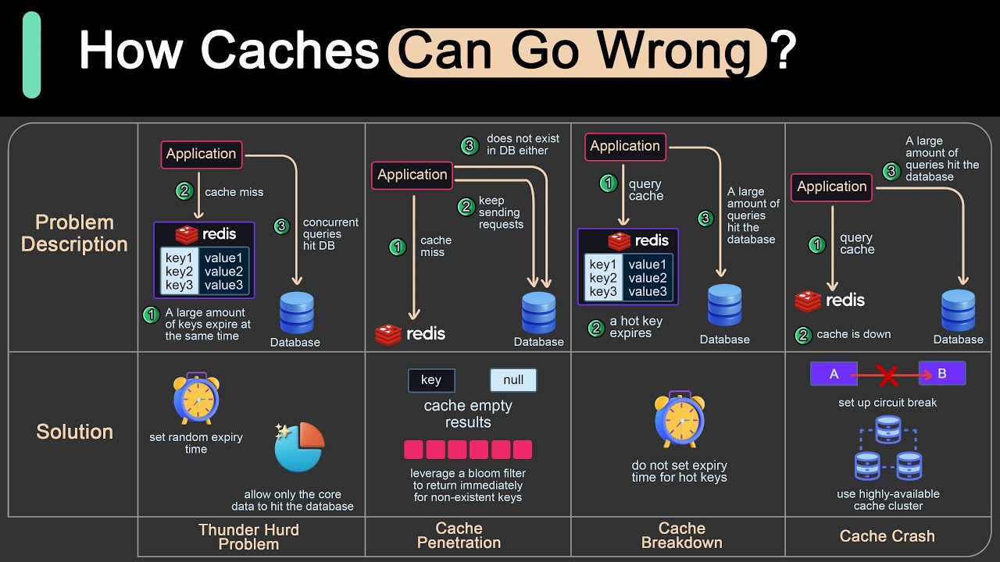

## Decoupling of App server nad Db

In LoadBalancer, we learned that when we type something on the browser( or search for a website specifically), 
the first thing browser has to do is talk to a DNS and figure out which IP address the browser should be talking to, 
and it communicates with the machine at that particular IP. 
And when you go from one machine to multiple machines, you need a load balancer to distribute traffic uniformly, 
but after a point when the amount of information cannot fit into a single machine, then the model needs to shard. 
It can be done using consistent hashing.
However, the machines had both the code and storage in the previous model. _Do you think it is a good model_????

1. Code and database are tightly coupled, and code deployments cause unavailability.
2. Fewer resources are available for the code since the database will also use some of the resources.

So it is better to decouple code and storage. 
However, the only downside of decoupling is the additional latency of going from one machine to another (code to the database).

So it can be concluded that it is not ideal for storing code and database on the same machine. 
The approach is to separate the code and storage parts to increase efficiency.

Different machines storing the same code running simultaneously are called Application Server Machines or App Servers. 
Since they don't store data and only have code parts, they are stateless and easily scalable machines.

------------------------------------------------------------------------------------------------------------------------

## Caching

**The process of storing things closer to you or in a faster storage system so that you can get them very fast can be termed caching.**
Caching happens at different places. 
### 1. In- Browser Caching
    We can cache some IPs so that browser doesn't need to communicate with the DNS server every time to get the same IP address. 
    This caching is done of smaller entries that are likely not to change very often and is called in-browser caching. 
    Browser caches DNS and static information like images, videos, and JavaScript files. 
    This is why a website takes time to load for the first time but loads quickly because the browser caches the information.

### 2. CDN ( Content Delivery Network)

You have the browser in some region(say India), and you must fetch the files from the servers located in another region(say the US). 

    When you try to access from your browser -> a request is made to the load balancer -> application server ->  file storage. 

    You know that transferring files and other data will be fast for the machines in the same region. 
    But it can take time for machines located on different continents.

From the website perspective, users worldwide should have a good experience, and these separate regions act as a hindrance. 
So what’s the solution?

The solution for the problem is _**CDN, Continent Delivery Network**_. Examples of CDN are companies like

1. Akamai
2. Cloudflare
3. CloudFront by Amazon
4. Fastly

These companies' primary job is to have machines worldwide, in every region. 
They store your data, distribute it to all the regions, 
and provide different CDN links to access data in a particular region. 

Suppose you are requesting data from the US region. 
Obviously, you can receive the HTML part/ code part quickly since it is much smaller than the multimedia images. 
For multimedia, you will get CDN links to files of your nearest region. 
Accessing these files from the nearest region happens at a much larger pace. 

**Also, you pay per use for using these CDN services.**

One question : how your machine talks to the nearest region only(gets its IP, not of some machine located in another region), 
when CDN has links for all the regions. Well, this happens in two ways:

1. A lot of ISP have CDN integrations. Tight coupling with them helps in giving access to the nearest IP address. For example, Netflix’s CDN does that.
2. Anycast (https://www.cloudflare.com/en-gb/learning/cdn/glossary/anycast-network/)

This CDN process to get information from the nearest machine is also a form of caching.

### 3. Local Caching
It is caching done on the application server so that we don't have to hit the database repeatedly to access data.

### 4. Global Caching

This is also termed In-memory caching.
In practice, systems like Redis and Memcache help to fetch actual or derived kinds of data quickly.

### Problems Caching brings
1. Cache has limited size
2. It is not the actual source of truth
3. It just stores the replica of original data source (database)
4. Data becomes stale and inconsistent with time -> we constantly need to fetch data after certain interval of time(TTL)
5. Because of limited size, we need to explore eviction policy

