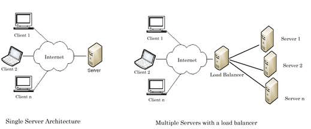
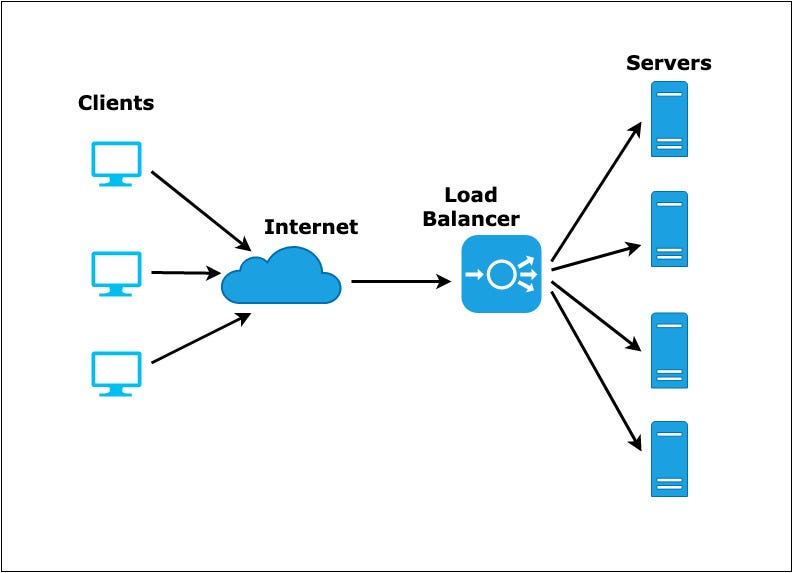
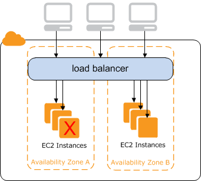
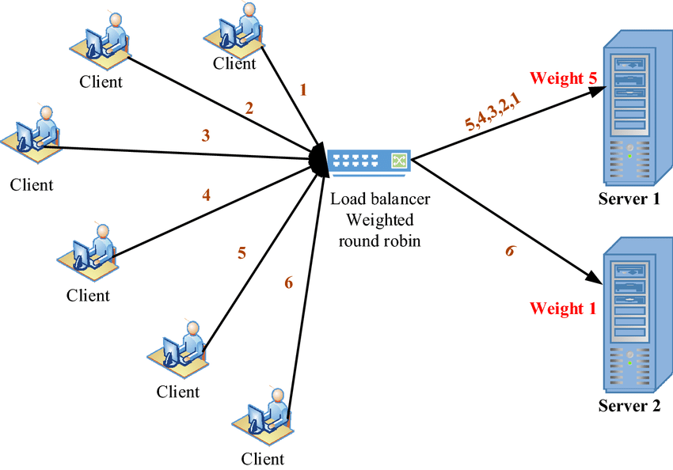
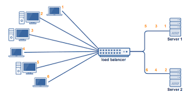
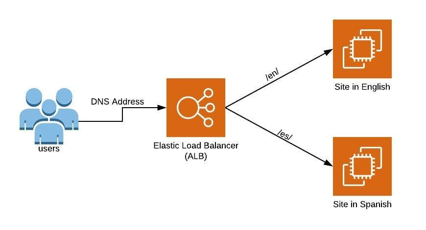
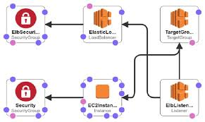

## Load Balancer

priVerse pushes a wide variety of updates to the platform every day, be it, features or any bug fixes. 
You are a developer at priVerse verse. 
You want to add a new property to the priVerse Verse. 
Assume that all the non-technical stuff like legal, accounting, and marketing is completed and we now want the users to know about the new property via a dedicated landing page. 
The Landing page should allow the users to join the waitlist for the property at a nominal fee of 500. 
You built the entire page.
The next step is to deploy the landing page on the actual priVerse Server.

For now, we will assume that priVerse is running on One Server only. 
You somehow log in to the server and copy the new code to the server either by using git or by using some other tool. 
Independent of the language (Node.js, Django, Ruby, etc.) being used, the running application must be restarted for the new changes to take effect. 
Given how huge the platform is, the application would take a considerable amount of time to boot up or load itself into the memory. 
During the loading time, your application is briefly unavailable. 
Users are receiving 502 from priVerse for some time.

As the traffic scales, we realised that the server is not able to withstand the load and is intermittently going down. 
To fix this, 
1. we try to optimise the code. 
2. We increase the memory, 
3. We increase storage and processor of the server to cater to the ever-increasing demand.

priVerse wants to increase the number of users on the platform. 
For the same, They hold a competition and you are informed that the traffic can increase by 10x.

DEAD END!!! What to do now?

###  solution, i.e., Install a LOAD BALANCER. 
It can help you tackle all of the above-mentioned issues whilst giving a significant performance boost.
BTW: Assumed architecture is known as a Single Server Architecture.

------------------------------------------------------------------------------------------------------------------------
**Load Balancer**
Before diving into what is Load Balancer and its features or advantages, let’s first try to think what would be our approach or algorithm for tackling the above issues.

1. What if there were 2 hosts for our application? 
2. When we want to deploy a newer version of our application, we could deploy them one by one on both these hosts while keeping at least one of them active at all times. 
3. A piece of code would be responsible for managing the traffic based on specific circumstances, for example, If one of the 2 hosts is not responding for some reason, be it, application failure or memory failure, the system could notify us immediately.

The deployment algorithm would follow the following steps:
`‘for’ each host for our application
    Mark the host as inactive
    Deploy the new code.
    Restart the application.
    Perform some basic sanity checks.
    Mark the host as active
    If a host is marked as inactive, 
        do not serve the traffic to that host and vice-versa,
    if a host is not responding to the traffic
        mark the host as inactive
****Only serve traffic from active hosts.*****
`

BTW: This piece of code is _Load Balancer._

**A load balancer is a device that distributes network or application traffic across several servers. 
It helps scale horizontally across an ever-increasing number of servers.**

Concept
A Load Balancer is a physical/virtual device used to balance the network load across Web-Servers. 
Load Balancer could sit inside the DCs for internal Load Balancing but usually are placed facing the internet to balance the load across the Web Servers in the Data-Centers.

From the above diagram, it is clear that the entry point of our application is now the Load Balancer itself and not the server itself. 
Now that we have a fleet of servers, we can efficiently manage and distribute the load or traffic across different servers.

The entire traffic, irrespective of whether it is from a handheld device or a system, arrives directly at the load balancer. 
The load balancer then sends the traffic to one of the available servers, based on certain decision-making algorithms. 
The response is then received from the server by the load balancer which is then straight away sent back to the client. 
Of course, we can make certain adjustments like a different load balancer of handheld devices but for the sake of simplicity, let’s first discuss this above architecture in detail. 
Assume that the number of EC2 servers (hosts) are infinite for now and that they can be added or removed as per our demand.

### Deployments
The deployments work more or less the way we discussed before. 
When we are about to deploy a new application version, we loop through all of the available hosts and for each host, 
we detach the host from the load balancer, deploy the new version on this host, 
restart the required services on the host and then reattach the host to the load balancer. 
This beautiful invisible dance helps push the newer updates quickly, reliably, and without downtime.

### Resilience
Since, the entire traffic flows through the load balancer, 
what if there is a certain low latency monitoring mechanism that notifies us if the traffic is increasing or decreasing at certain times. 
If we are notified before-hand, we can increase or decrease the hosts so that the load is distributed evenly across all the hosts. 
**The “Load Balancing”!**

The above approach is, however, a bit dangerous, because the traffic has already reached the load balancer. 
Remember, the LB, in our architecture, is configured to just push the traffic to one of the available servers blindly. 
By the time we add more hosts for our application, it might be too late. 
To curb this, we define a threshold above which we would want our hosts to be increased and a lower bound below which our hosts would be slowly removed.

This architecture also takes care of a scenario when some of our hosts are somehow down. 
If one or more of the hosts are down, LB has a mechanism known as “**Health Check**” by which it pings the available hosts after a certain point of time in regular intervals. 
If the host is unreachable, 
> it is marked as inactive or unhealthy and the host does not receive any traffic. 
>
What if our application has some kind of failover that brings back the host online? 
Right, 
> The LB will ping inactive servers as well to mark them as active in case they are ready to receive the traffic

### Security
What if, the LB is intelligent enough to detect whether the request received is a malicious request or a valid and genuine request? 
What if, the LB can automatically reject the request if it recognises it as an attack vector?

This is where the security aspect of LB comes into play. 
Since the LB is the entry point of all the requests, it reduces the chance of Servers’ IP addresses getting leaked, thereby reducing the chance of a direct attack on the server. 
If the LB is intelligent enough, it can also detect and discard malicious requests.

### Performance
Since, the LB is the entry point of the traffic, SSL/TLS encryption and decryption are usually configured directly on the LB to reduce the overhead from the servers. 
Yes, right! The traffic between the users and LB is encrypted but the traffic between the LB and servers is plain and is transmitted directly.

## But How does LB work in itself?

Reverse Proxy
Strictly speaking, A reverse proxy is a type of proxy server.  
Unlike a traditional proxy server, which is used to protect clients, a reverse proxy is used to protect servers. 
A reverse proxy is a server that accepts a request from a client, forwards the request to another one of many other servers, and returns the results from the server that processed the request to the client as if the proxy server had processed the request itself. 

The client only communicates directly with the reverse proxy server and it does not know that some other server processed its request.

So, the LB is working as a reverse proxy for us. This also fixes a security issue for us. 
If the response was directly sent from the server, it would have exposed a wide variety of information about the server in response headers. 
Reverse proxying the request ensures that the information in the response headers is that of the reverse proxy (LB in this case) and not of the running application’s server.

## Health Checks

Depending on the provider, The LB checks whether a host is active or not.
Active and Inactive terms are generic and providers generally use different terms to denote them. 
For instance, AWS uses Healthy and Unhealthy terms respectively.

LB pings the server at a certain port (8080) and requests a certain path (/) over a certain protocol (HTTP) after a certain interval (the 30s). 
The response timeout(5s) for every request is the maximum time LB will wait before terminating the request and marking the same as failed. 
A total number of Unhealthy Threshold (2) requests are required before marking any of the hosts as inactive or unhealthy. 
A total number of Healthy threshold (2) requests are necessary to declare the target host as an active or healthy host.

### Scale itself
Think of a case where LB is bombarded with an insane amount of requests such that LB goes down! 
Remember, LB is the entry point of our application and if it goes down, we are doomed!

Depending on the provider, There are different mechanisms put in place to ensure that LB is always ready to scale itself up and down as and when necessary. 
For instance, the load balancer has a traffic capacity in Gbps in AWS. 
It can scale itself automatically up to a maximum of 100 nodes.

### Algorithms
The algorithm widely and majorly used to efficiently manage load is Round Robin. 
You may already be familiar with the Round Robin algorithm but let’s cover it with the help of an architectural diagram.

Round Robin
Round-robin load balancing is the simplest and most commonly-used load balancing algorithm. 
Client requests are distributed to application servers in simple rotation. 
For example, if you have three application servers: the first client request is sent to the first application server in the list, the second client request to the second application server, the third client request to the third application server, 
and the fourth to the first application server, and so on.

### Concepts involved in setting up a Load Balancer
1. Listeners
    Listeners for a load balancer are the **combination of protocols and ports on which the LB will accept incoming requests**. 
    For example, in the above image, only HTTPS connection on 443 and HTTP connection on 80 will be accepted by the LB and the rest of the others will be discarded as-is. 
    We also define the destination for these requests. In the same directed image, HTTPS and HTTP both the requests will be forwarded to the HTTP port 8080 of the host.

2. Routing
 Load Balancer (in some cases) also allows us to forward a request to a defined destination based on certain conditions. 
 For example, Let’s say I would like to forward all the admin requests to an internal fleet of servers that can serve admin requests. 
 To achieve this, we can create a rule that states that if the request is admin (path matching), forward the request to an internal admin server.

3. Target Group
Each target group is used to route requests to one or more registered targets. 
When we create each listener rule, we specify a target group and conditions. 
When a rule condition is met, traffic is forwarded to the corresponding target group. 
We can create different target groups for different types of requests.
For example, create one target group for general requests and other target groups for requests to the microservices for your application.

------------------------------------------------------------------------------------------------------------------------
Further Reading and Questions
How is the traffic across different regions regulated? On a very high level, how would the deployment in this case execute? (“Global Server Load Balancer”)
Let’s say that a user is logged in to the account on host A. What if the next request for the same user goes to another host B? What kind of inconsistencies can arise in this case? (Session stickiness concept)
What is the dynamic and static content? How do you think the load balancer architecture works in this scenario? (Static content hosting)
Example configuration file: 

https://docs.nginx.com/nginx/admin-guide/load-balancer/http-load-balancer/ 
