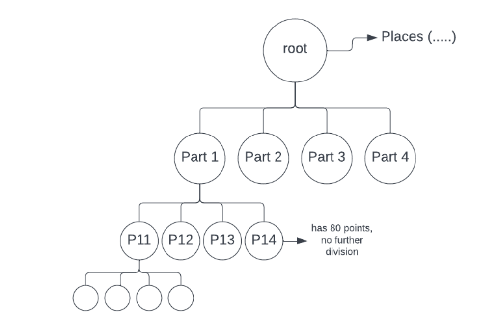

## Nearest Neighbors

There are a lot of systems that are built on locations, and location-based systems are unique kinds of systems that require different kinds of approaches to design. 
Conventional database systems don't work for location-based systems.

We will start the discussion with a **problem statement:**
On google Maps, wherever you are, you can search for nearby businesses, like restaurants, hotels, etc. 

If you were to design this kind of feature, how would you design the feature that will find you nearest X number of neighbors(say ten nearby restaurants)?

#### BruteForce
Well, the brute-force approach can simply get all restaurants along with their locations (latitude and longitude) and then find the distance from our current location (latitude and longitude). 
Simply euclidian distance between two points (x1, y1) and (x2, y2) in 2D space can be calculated with the formula d = √[(x2 – x1)2 + (y2 – y1)2.
This will calculate the distance around all points around the globe to get our X (say 10) nearest neighbors. 
**The approach will take a lot of time.**

#### Finding Locations Inside a Square
Another approach is to draw a square from our current location and then consider all the points/restaurants lying inside it to calculate X nearest ones. 
We can use the query: `SELECT * FROM places WHERE lat < x + k AND lat > x -k  AND long < y + k AND long > y-k`
> Here ‘x’ and ‘y’ are the coordinates of our current location, ‘lat’ is latitude, ‘long’ is longitude, and ‘k’ is the distance from the point (x,y).

Problems with this approach :
1. Finding right 'k' is difficult
2. Query time is high

#### Grid approach:

We can break the entire world into small grids (maybe 1 km sq. grids). 
Then to get all the points, we only need to consider the locations in the grid of our current location or the points in the adjacent grids. 
If there are enough points in these grids, then we can get all the nearest neighbors. 
The query and to get all the neighbors is depicted below: `SELECT * FROM places WHERE  grid_id IN (grid1, grid2, grid3……) `

##### What should be the size of the grid?
It is not ideal to have a uniform grid size worldwide. 
The grid size should be small for dense areas and large for sparse areas. 
For example, the grid size needs to be very large for the ocean and very small for densely populated areas. 
The thumb rule is that size of the grid is to be decided based on the number of points it contains. 
We need to design variable-size grids so that they have just enough points. 
Points are also dynamically evolving sets of places.

**Dividing the entire world into variable-size grids so that every grid has approximately 100 points**
So our problem statement reduces to 
1. preprocess all the places in the world so that we can get variable-size grids containing 100 points
2. We also need to have some algorithm to add or delete a point (a location such as a restaurant)

This can be achieved using quadtrees.

## Quad Tree

#### Creation:
Imagine the entire world with billions of points (think of a world map, a rectangle with points all over).

> We can say that the entire world is a root of a tree and has all of the places of the world. 
> We create a tree; if the current node has more than 100 points, then we need to create its four children (four because we need to create the same shape as a rectangle by splitting the bigger grid into four parts).
>

**We recursively repeat the process for the four parts as well**. 
**If any children have more than 100 points, it further divides itself into four children**. 
Every child has the same shape as the parent, a rectangle.

All the leaf nodes in the tree will have less than 100 points/places. 
And the tree's height will be ~log(N), N being the number of places in the world.

#### Finding the gridId
Now, suppose I give you my location (x,y) and ask you which grid/leaf I belong to. How will you do that? 
You can assume the whole world extends between coordinates (x1, y1) and (x2, y2).

What I can do is calculate the middle point for the x and y coordinates, 
`Xmid= (x1+x2) / 2`, 
`Ymid= (y1 + y2) / 2`. 
And then, I can check if the x is bigger than Xmid.
If yes, then the point will be present in either part 2 or 4, and if smaller than Xmid, the point will be in part 1 or 3. 
After that, I can compare y with Ymid to get the exact quadrant.

This process will be used to get the exact grid/leaf if I start from the root node, every time choosing one part out of 4 by the above-described process as I know exactly which child we need to go to.
Writing the process recursively:

`findgrid(x, y, root):
    X1, Y1 = root.left.corner
    X2, Y2 = root.right.corner
    If root.children.empty():      // root is already a leaf node
        Return root.gridno      // returning grid number
    If x > (X1 + X2) / 2:
        If y > (Y1 + Y2) / 2:
            findgrid(x, y, root.children[1])
        Else:
            findgrid(x, y, root.children[3])
    Else  y > (Y1 + Y2) / 2:
        If x > (X1 + X2) / 2:
            findgrid(x, y, root.children[0])
        Else:
            findgrid(x, y, root.children[2])
`
What is the time complexity of finding the grid to which I belong by above-mentioned method?
It will be equal to the height of the tree: log(N).

Once we find the grid, it becomes easy to calculate the nearby points. 
Every place in the world has been assigned a grid number and it is stored in MySQL DB. 
We can easily get all the required neighboring points.
If neighbors are not enough, we also have to consider neighboring grids

**To find the neighboring grids**:

**Next pointer Sibling**: While creating the tree, if we also maintain the next pointer for the leaves, then we can easily get the neighbors. 
It becomes easy to find siblings. 
We can travel to the left or right of the leaf to get the siblings.

#### Another way is by picking a point very close to the grid in all eight directions. 
For a point (X, Y) at the boundary, we can move X slightly, say X + 0.1, and check in which grid point ( X+ 0.1, Y) lies.
It will be a log(N) search for all 8 directions, and we will get all the grid ids.

##### Add a new Place
If I have to add a point (x, y), first, I will check which leaf node/ grid it belongs to. 
(Same process as finding a grid_id). And I will try to add one more place in the grid. 
If the total size of points in the grid remains less than the threshold (100), then I simply add. 
Otherwise, I will split the grid into four parts/children and redivide the points into four parts.
It will be done by going to MySQL DB and updating the grid id for these 100 places. 

##### Delete an existing place
Deletion is exactly the opposite of addition. If I delete a point and the summation of all the points in the four children becomes less than 100, then I can delete the children and go back to the parent. However, the deletion part is not that common

