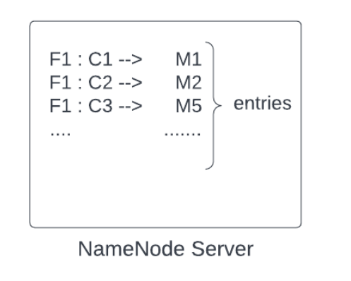

### Problem : How do we store large files?
>  how to store these large files (not only images but very large files, say a 50 TB file)

A large file can be a large video file or a log file containing the actions of the users (login, logout, and other interactions and responses), and it can keep increasing in size.

#### Conditions for building a large file system:
* Storage should be able to store large files
* Storage should be reliable and durable, and the files stored should not be lost.
* Downloading the uploaded file should be possible
* Analytics should be possible.

One way to store a large file is to divide it into chunks and store the chunks on different machines.
So suppose a 50 TB file is divided into chunks. 
What will be the size of the chunks? 
If we divide a 50 TB file into chunks of 1 MB, the number of parts will be : `50TB/1MB = (50 * 10^6) MB / 1 MB = 5 * 107 parts`

From this, we can conclude that if we keep the size of the chunk very small, then the number of parts of the file will be very high. 
It can result in issues like

1. **Collation of the parts**: concatenating too many files and returning them to the client will be overhead.

2. **Cost of entries**: We must keep metadata for the chunks,i.e., for a given chunk of a file, it is present on which machine. 
If we store metadata for every file, this is also an overhead.

### HDFS
HDFS stands for **Hadoop Distributed File System**. 

Below are certain terminologies related to HDFS:
> The default chunk size is 128 MB in HDFS 2.0. However, in HDFS 1.0, it was 64 MB.
> The metadata table we maintain to store chunk information is known as the ‘NameNode server'. 
It keeps mapping that chunks are present on which machine(data node) for a certain file. Say, for File 1, chunk 1 is present on machine 3.
> In HDFS, there will be only one name node server, and it will be replicated

You may wonder why the **chunk size is 128 MB**
The reason is that large file systems are built for certain operations like storing, downloading large files, or doing some analytics
And based on the types of operations, benchmarking is done to choose a proper chunk size
It is like ‘**what is the normal file size for which most people are using the system**’ and keeping chunk size accordingly so that system's performance is best.

_For example_,
chunk size of X1 performance is P1
chunk size of X2 performance is P2,
Similarly, doing benchmarking for different chunk sizes.
And then choosing the chunk size that gives the best performance.

In a nutshell, we can say benchmarking is done for the most common operations which people will be doing while using their system, 
and HDFS comes up with a value of default chunk size.

#### Making System reliable: 

We know that to make the distributed system reliable, we never store data on a single machine; we replicate it. 
Here also, a chunk cannot be stored on a single machine to make the system reliable. 
It needs to be saved on multiple machines. 
We will keep chunks on different data nodes and replicate them on other data nodes so that even if a machine goes down, we do not lose a particular chunk

#### Rack Aware Algorithm: 
For more reliability, keep data on different racks so that we do not lose our data even if a rack goes down. 
We avoid replicating the chunks on the machines of the same rack. 
This is because if there comes an issue with the power supply, the rack will go down, and data won't be available anywhere else.

So this was about chunk divisions and storing them on HDD. **Now comes the question of who does this division part**

The answer depends on the use case.

> Suppose there is a client who wants to upload a large file.
The client requests the app server and starts sending the stream of data. 
The app server on the other side has a client (HDFS client) running on it.

> HDFS also has a NameNode server to store metadata and data nodes to keep the actual data.
>
> The app server will call the name node server to get the default chunk size, NameNode server will respond to it ( say, the default chunk size is 128 MB).
> Now, the app server knows that it needs to make chunks of 128 MB. As soon as the app server collects 128 MB of data (equal to the chunk size) from the data stream, it sends the data to a data node after storing metadata about the chunk. Metadata about the chunk is stored in the name node server. For example, for a given file F1, nth chunk - Cn is stored in 3rd data node - D3.
> The client keeps on sending a stream of data, and again when the data received by the app server becomes equal to chunk size 128 MB (or the app server receives the end of the file), metadata about the chunk is stored in the name node server first and then chunk it send to the data node.

Briefly, the app server keeps receiving data; as soon as it reaches the threshold, it asks the name node server,
'where to persist it?', then it stores the data on the hard disk on a particular data node received from the name node server.

##### Downloading a file
Similar to upload, the client requests the app server to download a file.
* Suppose the app server receives a request for downloading file F1. 

* It will ask the name node server about the related information of the file, how many chunks are present, and from which data nodes to get those chunks.
.
* The name node server returns the metadata, say for File 1, goto data node 2 for chunk 1, to data node 3 for chunk 2, and so on. The application server will go to the particular data nodes and will fetch the data.

* As soon as the app server receives the first chunk, it sends the data to the client in a data stream. It is similar to what happened during the upload. Next, we receive the subsequent chunks and do the same.

**Torrent example**: Do you know how a file is downloaded very quickly from the torrent?

What is happening in the background is very similar to what we have discussed. 
The file is broken into multiple parts. 
If a movie of 1000MB is broken into 100 parts, we have 100 parts of 10 MB each.
If 100 people on torrent have this movie, then I can do 100 downloads in parallel. 
I can go to the first person and ask for part 1, the second person for part 2, and so forth. 
Whoever is done first, I can ask the person for the next part, which I haven't asked anybody yet. 
If a person is really fast and I have gotten a lot of parts, then I can even ask him for the remaining part, which I am receiving from someone, but the download rate is very slow.
https://www.explainthatstuff.com/howbittorrentworks.html

### Distributed File Systems
A Distributed File System (DFS) is a file system that is distributed on multiple file servers or multiple locations. 
It allows programs to access or store isolated files as they do with the local ones, allowing programmers to access files from any network or computer. 

##### Components of DFS
Location Transparency: Location Transparency achieves through the namespace component.
Redundancy: Redundancy is done through a file replication component.

The main purpose of the Distributed File System (DFS) is to allows users of physically distributed systems to share their data and resources by using a Common File System. 
A collection of workstations and mainframes connected by a Local Area Network (LAN) is a configuration on Distributed File System. 
A DFS is executed as a part of the operating system. 
In DFS, a namespace is created and this process is transparent for the clients. 

In the case of failure and heavy load, these components together improve data availability by allowing the sharing of data in different locations to be logically grouped under one folder, 
which is known as the “DFS root”.  

It is not necessary to use both the two components of DFS together, it is possible to use the namespace component without using the file replication component 
and it is perfectly possible to use the file replication component without using the namespace component between servers.

### Features of DFS

##### Transparency
**Structure transparency:** There is no need for the client to know about the number or locations of file servers and the storage devices. 
Multiple file servers should be provided for performance, adaptability, and dependability.

**Access transparency**: Both local and remote files should be accessible in the same manner. 
The file system should be automatically located on the accessed file and send it to the client’s side.

**Naming transparency**: There should not be any hint in the name of the file to the location of the file. 
Once a name is given to the file, it should not be changed during transferring from one node to another.

**Replication transparency**: If a file is copied on multiple nodes, both the copies of the file and their locations should be hidden from one node to another.

**User mobility**: It will automatically bring the user’s home directory to the node where the user logs in.

**Performance**: Performance is based on the average amount of time needed to convince the client requests. 
This time covers the CPU time + time taken to access secondary storage + network access time. 
It is advisable that the performance of the Distributed File System be similar to that of a centralized file system.

**Simplicity and ease of use**: The user interface of a file system should be simple and the number of commands in the file should be small.

**High availability**: A Distributed File System should be able to continue in case of any partial failures like a link failure, a node failure, or a storage drive crash.
A high authentic and adaptable distributed file system should have different and independent file servers for controlling different and independent storage devices.

**Scalability**: Since growing the network by adding new machines or joining two networks together is routine, the distributed system will inevitably grow over time. 
As a result, a good distributed file system should be built to scale quickly as the number of nodes and users in the system grows. 
Service should not be substantially disrupted as the number of nodes and users grows.

**Data integrity:** Multiple users frequently share a file system. 
The integrity of data saved in a shared file must be guaranteed by the file system. 
That is, concurrent access requests from many users who are competing for access to the same file must be correctly synchronized using a concurrency control method. 
Atomic transactions are a high-level concurrency management mechanism for data integrity that is frequently offered to users by a file system.

**Security**: A distributed file system should be secure so that its users may trust that their data will be kept private.
To safeguard the information contained in the file system from unwanted & unauthorized access, security mechanisms must be implemented