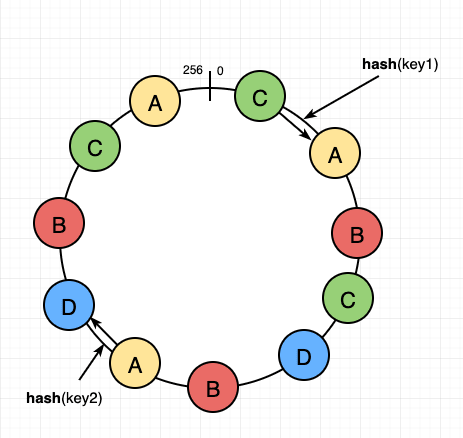

## What’s system design?

Low level design covers the structure of code in a given component. 
However, a large scale system will have multiple components / services. 
High level design is about the optimal design of which components to have for a fast and efficient system. 

### Why do we need system design ?
Lets understand this by an example.

Let’s take a real story of a website that started on a single laptop in a dorm room (Exactly how we write code today). 
Back in 2003, there was a website that went by the name of Del.icio.us (https://en.wikipedia.org/wiki/Delicious_(website)).
Browsing the internet was completely based on bookmarks and you would lose bookmarks the moment you changed browser / machine. 
So, delicious built a bookmarking website. 

> User logs in, and then bookmark websites using delicious tool. 
  That way, when you go to any other machine/browser, all you need to do is to login into delicious with your account to get access to all your bookmarks. 

Basically, largely delicious implemented following 2 functions:
1. addBookmark(userId, site_url)
2. getAllBookmarks(userId)

If we were to code those 2 functions on our laptop, would you be able to? 

Assume you store entries in MySQL database which is also on your laptop.
If yes, congratulations. Your version of delicious is almost ready.

_Problem 1:_ How do I ensure that when people type del.icio.us in their browsers, they reach my laptop?

> The internet world only understands IP Address. 
> How do people know the IP address of my laptop when they type del.icio.us?

How do we set-up our personal website today?
> We go to GoDaddy to buy a domain.
> Ok, but how does GoDaddy know which domain name is available? People can buy domains from GoDaddy / NameCheap / domains.google and tons of other websites.
> There must be a central place maintaining domain names and their owners. And yes, there is. It’s called **_ICANN_** (The Internet Corporation for Assigned Names and Numbers). 
> It’s non profit and has a directory of all registered domain names along with their owner details and the date validity.

Alright!!! 

But that still does not solve my problem. 
If I go to GoDaddy and buy delicious domain name, is my issue solved? 
A random user’s browser still does not know how to reach my laptop.

So, that means I should be able to associate my domain name to my laptop’s IP address. 
That is exactly what happens. We can create “A” record in GoDaddy / Namecheap that is then registered centrally. It might take some time to update in ICANN.

`ICANN knows IP address of my laptop tied to delicious domain name that I bought.`

Which means theoretically, when someone types delicious in their browser, they can get the IP address they need to go to from ICANN. But is that a good design?
Not really. ICANN becomes the single point of failure for the entire internet.

Ok, then what do we do? 
Imagine if there were thousands of machines all around the internet that had a copy of the information there on ICANN. 
Then my problem could have been solved. 
Because now people typing delicious on their browser, could find out the IP address from these machines.

Very simplistically, these machines are called **_**DNS machines**_** (Domain Name Servers). 
While the DNS architecture is decently complicated, in simple words, 
    "DNS machines maintain a copy of information present centrally and 
    they keep pinging every few hours to get any recent updates from the central machines."

Ok, so now we are live. Delicious is now serving users.

------------------------------------------------------------------------------------------------------------------------

_Problem 2:_ Everytime I want to add new features and re-deploy and re-start my laptop with new code, delicious is unavailable for a few seconds. 
That’s not good. So, what do I do?
Maybe instead of one laptop, I have multiple laptops with same code and same information (We will figure out how to keep this information in sync). 
However, when my code is being deployed to a laptop X, how do I ensure no traffic is coming to X?

> We need a _**Load Balancer**_ which keeps track of laptops, which ones are running and is responsible to split the load equally.

### How does Load balancer work?

> Which machines are alive? - Heartbeat / Health Check
> Splitting load? - Round robin / Weighted Round Robin / Ip Hash

------------------------------------------------------------------------------------------------------------------------

Imagine, Del.icio.us becomes majorly popular. 
It starts getting massive traffic. 
It starts getting a million new bookmarks every day.
Now, remember this is 2004. Best machines had 40GB hard disk. 
If we were getting 1 Million new bookmarks every day, and every bookmark we have is of 200 bytes roughly, 
then we are adding 200MB of new bookmarks every day. 
Which means we will run out of space in 6 months. What do we do?

_Problem 3:_ **We will have to consider splitting the information you have between machines. This is called sharding.**

* Step 1: Choose sharding key. Basically what information should not get split between machines - it would be an expensive query to fetch data from multiple machines, 
    and should reside in the same machine.
    ** 1. Show what happens if we choose site_url as the sharding key. getAllBookmarks has to go to all machines.
    ** 2. We choose user_id to be the sharding key, which means a user and all their bookmarks go to one shard.

* Step 2: Build out an algo for userId -> shard mapping.

Finding shard given userID should be extremely lightweight. Can’t add a lot of load to LB.
Load should be somewhat equally distributed (no load skew)
Addition of new shards should be easy and should not cause major downtime.
Same for removal of shards.

Let’s check certain approach for sharding:
Approach 1: Assign userId to userId % number_of_shards. While this approach is great, it fails when number of shards change, as it causes almost every user’s data to be copied to another machine. Massive downtime when shard is added.

Approach 2: Range based assignment. Load skew - first adopters more likely to be busier users. Also, every range’s total storage usage will only increase as they add more bookmarks. Addition of new shard does not help existing shards.
------------------------------------------------------------------------------------------------------------------------
## Consistent Hashing

Let’s look at the real approach used in most cases - **Consistent Hashing.**

_Consistent Hashing_:

> Imagine a circle with points from [0, 10^18]. 
> Imagine there is a hash function H1, which maps every machineId to a number in [0, 10^18], which you then mark on the circle. 
> Similarly, there is another hash function H which maps userId to [0, 10^18].
> Let’s assume we assign a user to be present on the first machine in the cyclic order from the hash of the user.

However, this design suffers from an issue. 
> What happens when you remove a shard. 

So, we modify the consistent hashing a little bit. Instead of one hash per machine, you use multiple hashing functions per machine (the more, the better). 
So, Node 1 is present at multiple places, Node 2 at multiple places and so forth.

1. if node A dies, some range of users is assigned to B, some to D and some to C. That is the ideal behavior.

Further reading:
https://www.namecheap.com/support/knowledgebase/article.aspx/319/2237/how-can-i-set-up-an-a-address-record-for-my-domain/
https://support.dnsimple.com/articles/differences-between-a-cname-alias-url/
https://support.dnsimple.com/articles/differences-between-a-cname-alias-url/
https://docs.nginx.com/nginx/admin-guide/load-balancer/http-load-balancer/ 
