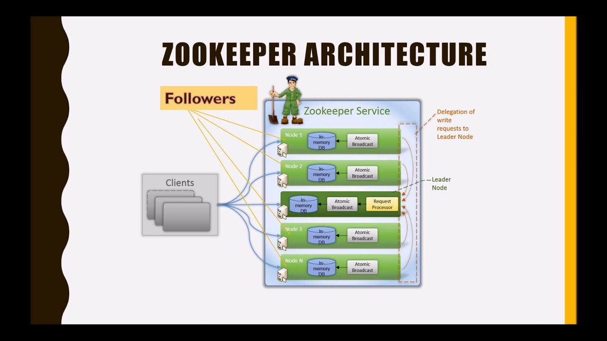

## Problem Statement 1 (State tracking):

In a Master Slave architecture, all writes must come to the master and not the slave machines. 
This means all clients (appservers) must be aware of who the master is. As long as the master is the same, that’s not an issue.

The problem is, If the master might die, and in that case we want to select a new master and all the machines should be aware of it, they should be in sync.

If you were to think of this as a problem statement, how would you solve it?

A naive approach might be to say that we will have a Dedicated machine and the only job of this machine is to keep track of who the master is. 
Anytime an appserver wants to know who the master is, they go and ask this dedicated machine. 

However, there are 2 issues with this approach.
1. This dedicated machine will become the single point of failure. If the machine is down, no writes can happen - even though the master might be healthy.
2. For every request, we have introduced an additional hop to find out who the master is. 

**How do these machines find out who the master is?**
**How do we make sure that all these machines have the same information about the master?**
**How do we enable appservers to directly go to master without the additional hop to these machines?**

### Solution : Zookeeper

Zookeeper is a generic system that tracks data in strongly consistent form. More on this later.

Storage in Zookeeper is exactly like a file system.
Example, we have a root folder inside that we have bunch of files or directories. 

