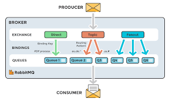

## Problem Statement 1 (State tracking):

In a Master Slave architecture, all writes must come to the master and not the slave machines. 
This means all clients (appservers) must be aware of who the master is. As long as the master is the same, that’s not an issue.

The problem is, If the master might die, and in that case we want to select a new master and all the machines should be aware of it, they should be in sync.

If you were to think of this as a problem statement, how would you solve it?

A naive approach might be to say that we will have a Dedicated machine and the only job of this machine is to keep track of who the master is. 
Anytime an appserver wants to know who the master is, they go and ask this dedicated machine. 

However, there are 2 issues with this approach.
1. This dedicated machine will become the single point of failure. If the machine is down, no writes can happen - even though the master might be healthy.
2. For every request, we have introduced an additional hop to find out who the master is. 

**How do these machines find out who the master is?**
**How do we make sure that all these machines have the same information about the master?**
**How do we enable appservers to directly go to master without the additional hop to these machines?**

### Solution : Zookeeper

Zookeeper is a generic system that tracks data in strongly consistent form. More on this later.

Storage in Zookeeper is exactly like a file system.
Example, we have a root folder inside that we have bunch of files or directories. 

All these files are known as ZK nodes in zookeeper. 

#### ZK Nodes:
Every file in zookeeper is of one of two kinds:
1. Ephemeral : Ephemeral nodes (do not confuse node to mean a machine. Nodes are files in the context of Zookeeper) are files where the data written is only valid till the machine/session which wrote the data is alive/active. This is a fancier way of saying that the machine which wrote on this node has to keep sending heartbeat to ensure the data on this node is not deleted.
    >  Once an ephemeral node is written, other machines / sessions cannot write any data on it. An ephemeral node has exactly one session/machine as the owner. Only the owner can modify the data.
    >  When the owner does not send a heartbeat, the session dies and the ephemeral node is deleted. This means any other machine can then create the same node/file with different data.
    >  These are the nodes which are used to track machine status, master of a cluster, taking a distributed lock, etc. More on this later.

2. Persistent :  Persistent nodes are nodes where the node is not deleted unless specifically requested to be deleted. 
    These nodes are used to store configuration variables.

#### ZK Node for consistency / Master Election
To keep things simple, let’s imagine that Zookeeper is a single machine (we will move to multiple machines later). 
Let’s imagine there are a bunch of storage machines in a cluster X.

They all want to become master. 
However, there can only be one master. 
So, how do we resolve the “**kaun banega master**” challenge. 
We ask all of them to try to write their IP address as data to the same ephemeral ZK node (let’s say /clusterx/master_ip).

Note that only one node will be able to write to this ephemeral node and all other writes will fail.
So, let’s say M2 was able to write M2’s ip address on /clusterx/master_ip.
Now, as long as M2 is alive and keeps sending heartbeat, /clusterx/master_ip will have M2’s ip address. 
When any machine tries to read data on /clusterx/master_ip, they will get M2’s ip address in return.

#### ZK: Setting up a watch:
There is still the additional hop problem. 
If all appservers and other machines have to talk to the zookeeper on every request to find out who the master is, not only does it add so much load to zookeeper, ,
it also increases hops of every request.

##### How can we address that?
If you think about it, the data on ephemeral node changes very less frequently (probably like once in a day - not even that). 
It seems stupid that every client has to come to ZK to ask for the master value when it does not change most of the time.
So, how about we reverse the process. 

We tell people, “Here is the value X. 
No need to keep asking me again and again. 
Keep using this value. 
Whenever this value gets updated, I(ZK) will notify you.”. 

Zookeeper does a similar thing. 
It solves that using a “**subscribe to updates on this ZK node**” option.
On any ZK node, we can set a watch (subscribe to updates). 
In ZooKeeper, all the read operations have the option of setting a watch as a side effect.
If I am an appserver, and I set a watch on /clusterx/master_ip, then when this node data changes or this node gets deleted, 
I (and all other clients who had set a watch on that node) will be notified. 
**This means when clients set a watch, zookeeper maintains a list of subscribers (per node/file).** 

#### ZK Architecture:
All of this is great. 
But we were assuming ZK is a single machine. 
**But ZK cannot be a single machine**. How does this work across multiple machines?

Now the problem is Zookeeper is a single machine and if it’s a single machine it becomes a single point of failure.
Hence zookeeper is actually a bunch of machines (odd number of machines). 

Zookeeper machines also select a leader/master among themselves.
> When you setup the set of machines (or when the existing leader dies in case of running cluster), the first step is electing the leader.

Now, let's say Z3 is elected as leader, whenever any write is done, for Eg, change /master ip address to ip,
x then it is first written to the leader and leader broadcasts that change to all other machines. 

If at least the majority of the machines (including the leader) acknowledge the change, 
then the write is considered successful, otherwise it is rolled back.

So, in a cluster of 5 machines, 3 machines need to acknowledge for the write to succeed (in a cluster of 7, 4 machines need to acknowledge and so forth).
Note that even if a machine dies, the total number of machines still stays 5, and hence even then 3 machines need to acknowledge.  

Hence, if 10 machines were trying to become the master and they all sent requests to write to /clusterx/master simultaneously, all those requests would come to a single machine - the leader, first. 
The leader can implement a lock to ensure only one of those requests goes through first, and the data is written if majority ZK machines acknowledge.
Else data is rolled back, lock released and then the next request gets the lock. 

##### But why the majority number of machines ??

Let's imagine we let the write succeed if it succeeds on X/2 number of machines (X being the total number of machines). 
For this let’s imagine we have 5 zookeeper machines, and because of network partition z1 and z2 become disconnected from the other 3 machines. 

Let’s say write1 (/clusterx/master_ip = ip1) happens on z1 and z2. .
Let’s say another write write2 (/clusterx/master_ip = ip2) happens for the same ZK node on z4 and z5. 

Now when we try to read (/clusterx/master_ip) then half of the machines would suggest ip1 is master, and the other half would return ip2 as master. 
This is called **split brain**.
Hence we need Quorum / Majority so that we don’t end up having 2 sets of machines saying x is the answer or y is the answer, there should be consistency.

So till the write is not successful on majority of the machines we can’t return success, 
now in this case both ip1 and ip2 try to write in Z3 and whoever succeeds the master will have that address and the other one fails

#### ZK : master dies:

Imagine master had written it’s ip address to /clusterx/master_ip. 
All appservers and slaves had set watch on the same node (noting down the current master IP address).

**Imagine the master dies. What happens?**

> Master machine won’t be able to send heartbeat to the zookeeper for the ephemeral node /clusterx/master_ip
> The ephemeral node /clusterx/master_ip will hence be deleted.
> All subscribers will be notified of the change.
> Slaves, as soon as they get this update, will try to become masters again. Whoever is the first one to write on Zookeeper becomes the new master.
> Appserver will delete the local value of master_ip. They would have to read from the zookeeper (+set new watch + update local master_ip value) whenever the new write request comes.
> If they get back null as value, the request fails. New master is not selected yet.
> Old master whenever it comes back up will read from the same ZK node to find out the new master machine and will become a slave itself.
> Unless it comes back up quickly, finds ZK node to be null and tries along with other slaves to become the new master. 
> 

## Problem Statement 2 : Async tasks
Let’s take an example of the messenger,
Imagine whenever a message comes for a user, say abhi sends a message to raj, so the message is written in the raj database. 

After this we want to do a couple of things.
Notify raj
Email to raj
(If raj is not reading messages for the last 24 hrs).
Update relevant metrics in analytics
Now whenever a message comes, we have to do these things but we don’t want that the sender of the message to wait for these things to happen. Infact, if any of the above fails, it does not mean that the message sent itself failed.
So how to return success immediately?

#### Solution
To solve these types of problems where we have to do a few things asynchronously we use something known as Persistent Queue.
**Persistent Queue is durable which means we are actually writing it in a hard disk so that we won’t lose it.** 

**Persistent Queues work on a model called pub-sub (Publish Subscribe).** 

##### PubSub:
Pubsub has 2 parts:
1. Publish: You look at all events of interest that would require actions post it. For example, a message being sent is an event. Or imagine someone buys an item on Flipkart. That could be an event. You publish that event on a persistent queue.
2. Subscriber: Different events could have different kind of subscribers interested in that event. They consume events they have subscribed to from the queue. For example, in the above example, message notification system, message email system and message analytics system would subscribe to the event of “a message sent” on the queue.
Or an invoice generation system could subscribe to the event of “bought an item on Flipkart”.

There could be multiple types of events being published, and each event could have multiple kind of subscriber consuming these events. 

##### Topics:
Now within a queue also we need some segregation of topics because the system doesn't want to subscribe to the whole queue, 
they need to subscribe to some particular type of event and each of these events is called topic.

Let’s take an example of Flipkart,
Say, flipkart also has an inbuilt messaging service; we can message the vendor about the quality and feedback of the product.
These are the two events, now after that, we want certain things to happen, 

Here both the events are very different.
If we publish both of the events in a single persistent queue, and let’s say invoice generation has subscribed to the queue then it will get a lot of garbage
Hence we say all the events are not the same, and we classify them in different topics. 

Now the invoice generation has only subscribed to Topic1 and would only get messages from Topic1.
One such high throughput system that implements persistent queue and supports Topics is **KAFKA**.

> In general, persistent queues help handle systems where producers consume at a different rate and there are multiple consumers who consume at a different pace asynchronously. 
> Persistent Queues take guarantee of not loosing the event (within a retention period) and let consumers work asynchronously without blocking the producers for their core job. 

##### Terminologies:
**Producer**: Systems that publish events (to a topic) are called producers. There could be multiple producers.

**Consumer**: Systems that consume events from subscribed topic (/topics) are called consumers.

**Broker**: All machines within the Kafka cluster are called brokers. Just a fancy name for machines storing published events for a topic.

**Partition**: Within a single topic, you can configure multiple partitions. Multiple partitions enables Kafka to internally shard / distribute load effectively. 
It also helps consumers consume faster.

**Event retention period**: Kafka or any persistent queue is designed to store events transiently and not forever. 
Hence, you specify event retention period, which is the period till which the event is stored. 
All events older than retention period are periodically cleaned up

#### Problems now :
> What if a topic is so large (so there are so many producers for the topic), that the entire topic (even for the retention period) might not fit in a single machine. 
> How do we shard?

Ans : Kafka lets us specify number of partitions for every topic. 
A single partition cannot be broken down between machines, but different partitions can reside on different machines.
Adding enough partitions would let Kafka internally assign topic+partition to different machines. 

> With different partitions, it won’t remain a queue anymore. 
> I mean wouldn’t it become really hard to guarantee ordering of messages between partitions? 
 
Ans : For example, for topic messages, m1 comes to partition1, m2 comes to partition2, m3 comes to partition 2, m4 comes to partition 2 and m5 comes to partition 1. 
Now, if I am a consumer, I have no way of knowing which partition has the next most recent message.

Adding ways for us to know ordering of messages between partitions is an additional overhead and not good for the throughput.
It is possible we don’t even care about the strict ordering of messages.

Let’s take an example. Take the case of Flipkart. Imagine we have a topic Messages where every message from customer to vendor gets published. 
Imagine we have a consumer which notifies the vendors.
Now, I don’t really care about the ordering of messages for 2 different users, but I might care about the ordering of messages for the messages from the same user. 
If not in order, the messages might not make sense.

What if there was a way of making sure all messages from the same user ends up in the same partition. Kafka allows that

Producers can optionally specify a key along with the message being sent to the topic. 

And then Kafka simply does **hash(key) % num_partitions** to send this message to one of the partition. 
If 2 messages have the same key, they end up on the same partition. 
So, if we use sender_id as the key with all messages published, it would guarantee that all messages with the same sender end up on the same partition. 

Within the same partition, it’s easier to maintain ordering. 

**What if a topic is super big???**

And hence it would take ages for a single consumer to consume all events. What do we do then?
In such a cases, the only way is to have multiple consumers working in parallel working on different set of events.
Kafka enables that through consumer groups. 

##### Consumer groups:
A consumer group is a collection of consumer machines, which would consume from the same topic. 
Internally, every consumer in the consumer groups gets tagged to one or more partition exclusively 
(this means it's useless to have more consumer machines than the number of partition) and every consumer then only gets messages from the relevant partition. 
This helps process events from topics in parallel across various consumers in consumer group

##### If one or more machines(broker) within Kafka die, how do I ensure I never lose events? 

Same solution as every other case. **Replicate**.
Kafka lets you configure how many replica you wish to have. 
Later, for every partition, primary replica and other replicas are assigned between machines/brokers. 

**Example**: See below image, when Kafka has 3 machines, 2 topics and each topic has 2 partitions. Replication configured to be 2. 

##### If I am a producer or a consumer, how do I know which Kafka machine to talk to?

Kafka says it does not matter. Talk to any machine/broker in Kafka cluster and it will redirect to the right machines internally. Super simple.

##### If I am a consumer group, and I have already consumed all events in a topic, then when new events arrive, how do I ensure I only pull the new events in the topic? 

If you think about it, you would need to track an offset (how much have I already read) so that you can fetch only events post the offset

## Kafka:

Scaler has a huge number of learners who use the platform parallely, and do multiple activities like during live lectures they ask questions, send chat messages, give reactions,  at other times they solve problems for assignment and homework, check dashboard, check leaderboard, order swags from Scaler store and all these activities for every student will need to be tracked and monitored. 
These actions served as inputs for an array of applications on the backend such as machine learning systems, search optimizers, and report generators which all play an important role in enriching the user experience.

Other information like device from which the student is logging in, probably location updates, and more such information, what would be a correct way to develop a system which can take all these information and store them for 	future reference. 
This monitoring and storing of data should not impact the performance of the application and students should not feel any lag or slowness in the system.

Scaler wants to increase the number of students on the platform, you have to design a system which should also work when the load becomes 10X the current load.

What to do now?

Of course, you talk to some of your fellow engineers or read something online to find the solution, i.e., Setup a Messaging Queue. It can help you create a process to consume all the activities done by students on the website and store them without impacting the performance of the actual system. 

### Messaging Queue 

A message queue is a form of asynchronous service-to-service communication used in serverless and microservices architectures. 
Messages are stored on the queue until they are processed and deleted. Each message is processed only once, by a single consumer. 
Message queues can be used to decouple heavyweight processing, to buffer or batch work, and to smooth spiky workloads

We can have single of multiple senders sending messages and multiple receivers accepting the message as well, messaging queue works asynchronously and helps in transferring the data between multiple services.

There are multiple messaging queues available to be used like :
1. Kafka
2. AWS SQS
3. RabbitMQ
4. Tibco

We would be using Kafka as a messaging queue going ahead. 

### Kafka
A distributed event streaming platform that lets you read, write, store, and process events (also called records or messages in the documentation) across many machines.

At a high level, Apache Kafka allows you to publish and subscribe to streams of records, store these streams in the order they were created, and process these streams in real time.

Now let’s dig a bit deeper

#### Producer
Client application that push events into topics

#### Cluster
One or more servers (called brokers) running Apache Kafka

#### Topic
The method to categorize and durably store events. 
There are two types of topics: compacted and regular. 
Records in compacted topics do not expire based on time or space bounds. 
Newer topic messages update older messages that possess the same key and Apache Kafka does not delete the latest message unless deleted by the user.
For regular topics, records can be configured to expire, deleting old data to free storage space.

#### Partition
The mechanism to distribute data across multiple storage servers (brokers). 
Messages are indexed and stored together with a timestamp and ordered by the position of the message within a partition.
Partitions are distributed across a node cluster and are replicated to multiple servers to ensure that Apache Kafka delivers message streams in a fault-tolerant manner

#### Consumers
Client applications which read and process the events from partitions. 
The Apache Kafka Streams API allows writing Java applications which pull data from Topics and write results back to Apache Kafka. 
External stream processing systems such as Apache Spark, Apache Apex, Apache Flink, Apache NiFi and Apache Storm can also be applied to these message streams

### Why multiple partitions ?

By dividing a topic into multiple partitions, Apache Kafka provides load balancing over a pool of servers. 
This allows you to scale production clusters up or down to fit your needs and to spread clusters across geographic regions or availability zones.

##### Low latency
By decoupling data streams, Apache Kafka is able to deliver messages at network limited throughput using a cluster of servers with extremely low latency (as low as 2ms).

##### Fault-tolerant cluster and Intra-cluster replication
Fault tolerance refers to the ability of a system (computer, network, cloud cluster, etc.) to continue operating without interruption when one or more of its components fail.

The objective of creating a fault-tolerant system is to prevent disruptions arising from a single point of failure, ensuring the high availability and business continuity of mission-critical applications or systems.

Intra-cluster replication means one cluster replicates its own set of storage with another cluster and its set of storage.

Apache Kafka makes the data highly fault-tolerant and durable in two main ways. 
> First, it protects against server failure by distributing storage of data streams in a fault-tolerant cluster. 
> Second, it provides intra-cluster replication because it persists the messages to disk.

#### Examples

We will build two different projects to understand the work and setup of Kafka.

1. Basic setup where we will have one producer and one consumer, both pushing and consuming messages from a single Kafka topic. .
We will build and run this from our terminal.

2. We will try to create basic design for a distributed system containing different micro-services, we will build a online test consultation service, which will have the following micro services :

Dashboard for users to book a test -> BookingService
Service which will accept bookings and allocate a lab for each test -> LabService
Service which consume the user booking and store in DB for analytics purposes -> DataService

BookingService will produce data and push messages to a Kafka topic, LabService and DataService will consume the messages from the kafka topic and do their respective tasks. 

