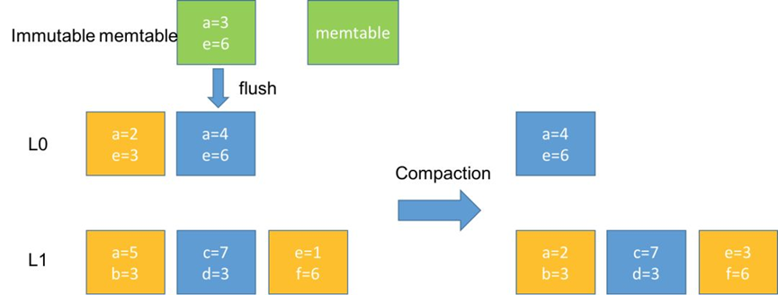
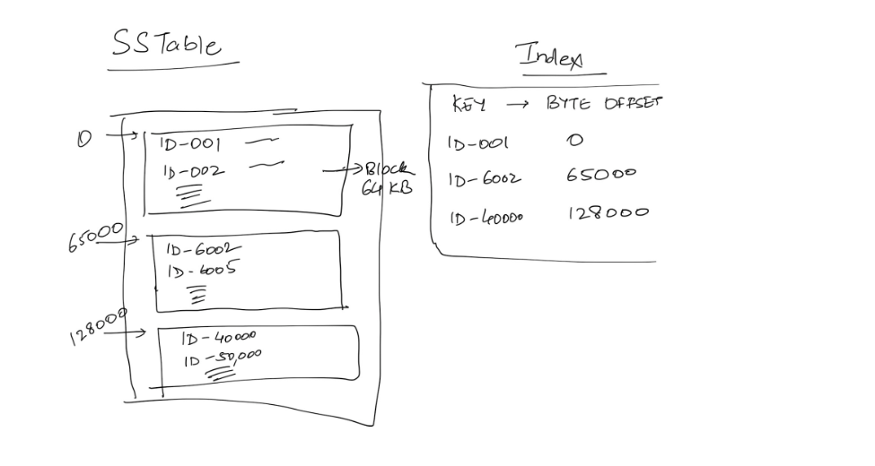
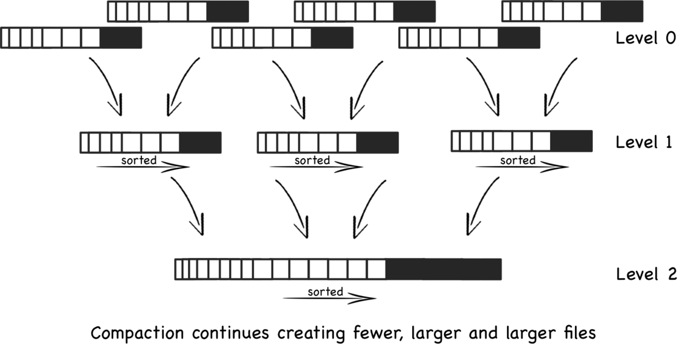
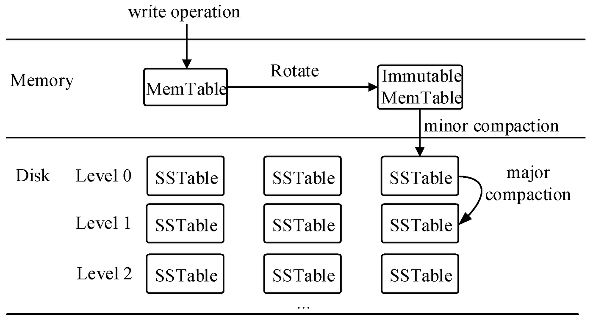
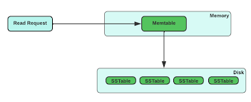
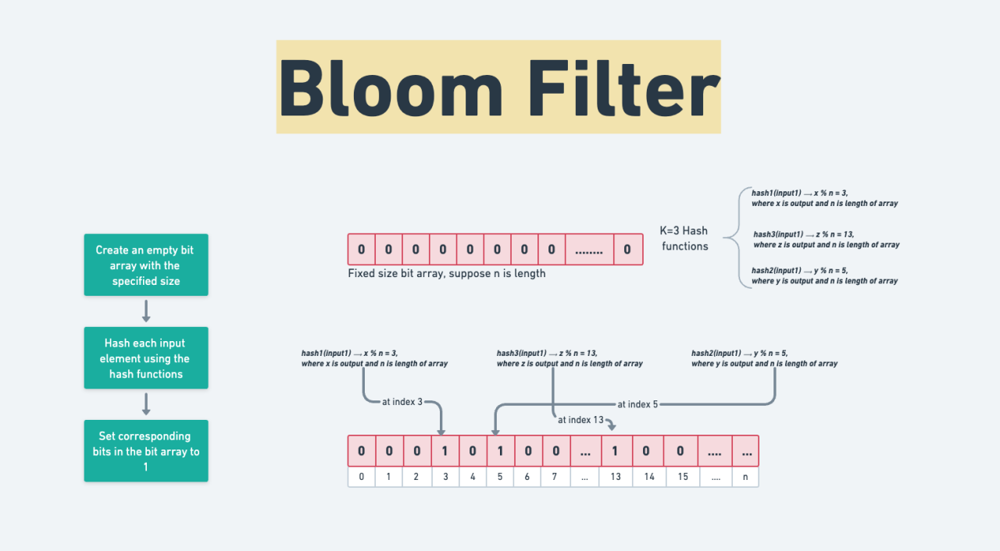

## Problems 
1. Unlike SQL, NOSQL is unstructured and has no fixed size.
2. How to design the system so that Updates don’t take too much of time, they are feasible to do.

3. In SQL, both write and read take log(N) time.
   Therefore, how can we design our NOSQL system? Additionally how do we tweak such a system for read heavy vs write heavy system?

#### Solution:
Most NOSQL systems have 2 forms of storage :
> **WAL (Write ahead Log):** This is an append only log of every write (new write / update) happening on the DB. 
> Theoretically, even if you start from zero, you can replay all of these logs to arrive at the final state of the DB.

Think of this as a really large file. You only append to this file and in most cases, never read from this file.

> Reads if done are mostly asking for a tail of this file (entries after timestamp X which are the last Y number of entries in this file).  
The current state of data.

We will discuss how to store the current state of data effectively.

#### Key: Value / RowKey: Column Family:

If we had fixed size entries, we know we could use B-Trees to store entries.
For the sake of simplicity, let’s assume we are only talking about a key-value store for now.

What is the brute force way of storing key values?
Maybe I store all keys and values in a file.

Now, imagine, there is a request to update the value of “ID 002” to “Ram”. 
Brute force would be to go find “ID 002” in the file and update the value corresponding to it. 
If there is a read request for “ID 002”, I again will have to scan the entire file to find the key “ID 002”.

This seems very slow. Both reads and writes will be very slow. 

Also, note that the value is not of fixed size. 
Also, note that when there are multiple threads trying to update the value of ID 002, they will have to take write lock (which will make things even slower). 

Can we do something better?

**What if all new writes were just appended to the file.**

This will cause duplicate keys, but if you notice my **write will become super fast.** 

For reads, I can search for keys from the end of the file, and stop at the first matching key I find. That will be the latest entry. So, reads continue to be slow, but I have made my writes much faster.
> One downside is that now I have duplicate entries and I might require more storage. 
Essentially, in this approach, we are indicating that every entry is immutable. You don’t edit an entry once written.  
> Hence, writes don’t require locks anymore.

Reads are still super slow. O(N) in the worst case. **Can we do something better?**

What if we somehow index where the keys are. 
Imagine if there was an in-memory index (hashmap) which stored where the keys were in the file (offset bytes to seek to, to read the latest entry about the key).

This way, the read has the following flow:

And write is no more just a simple append to the file. 
It has an additional step of updating the in-memory hashmap.
This would ensure the read need not go through the entire file, and is hence no more O(N).

But there is a big flaw here. 

> We are assuming all keys and offset will fit in-memory. 
> In reality, a key value store might have billions of keys. 
> And hence, storing such a map in memory might not even be feasible. 
> So, how do we address that? 
> Also, note that we still need a lot of memory to store duplicate older entries that are lying around.

Let’s solve both one by one. How do we make the storage more efficient?

One simple answer is that we can have a background process which reads this file,
removes the duplicates and creates another file (and updates the in-memory hashmap with new offsets). 

However, while the idea is correct, the implementation is easier said than done. N
ote that these are really large files. 
How do we even find duplicates quickly? 

Also, we cannot read the entire file at once. So, how do you do that in chunks that you can read all at once?

1. [ ] If I were to read the file in chunks of 100MB, then why have the entire thing as one single file.
2. [ ] Why not have different files for these chunks. 
3. [ ] This will enable me to have the latest file (latest chunk) in memory, 
4. [ ] which I can write to disk when it is about to be full [Let’s call this file as the “memTable”]. 
5. [ ] The latest chunk gets all the writes and is most likely to have the most recent entries for frequently asked items.
6. [ ] Also, I can avoid appending to MemTable, as it is in-memory HashMap and 
7. [ ] I can directly update the value corresponding to the key [memTable will not have duplicates].

In parallel, we can merge the existing chunks [chunkX, chunkY - immutable files as new entries only affect memTable] into new chunks [chunkZ].  

> Delete after removing duplicate entries 
> [Easier to find the latest entry from the in-memory hashmap which tells you whether the entry you have is duplicate or not]. 

Note that chunkX and chunkY are deleted, once chunkZ is created and in-memory hashmap updated. Let’s call this process “compaction”.

> So, while storage might temporarily have duplicates across older chunks, compaction time to time will ensure the duplicate entries are compacted. 
> Compaction process can run during off-peak traffic hours so that it does not affect the performance during peak times.

Ok, this is great! However, we still have not addressed the fact that our in-memory hashmap storing the offset for keys might not fit in memory.

##### Question: Given now new writes are coming to memTable, is storing keys in random order really optimal? 
How do we optimize searching in file without a hashmap which stores entries for all keys? Hint: Sorting?

What if memTable had all entries sorted ? 
[What data structure should we use then - TreeMap? Internally implemented through Balanced binary trees]. 
What if memTable had all entries stored in a balanced binary tree (like Red Black Tree or AVL trees or Binary Search Tree with rotations for balancing).

That way, whenever memTable is full, when flushing content to disk, I can flush in sorted order of keys (Just like in TreeMap, we can iterate in sorted order). 
Let’s call these files SSTables [Sorted String Table]. 
With sorted order, we can do some form of binary search in the file.

But, how do I do binary search because I can land on some random byte in the file in binary search and I would have no way of finding which key/value this byte is from.

**So, how about I split the file into blocks of 64Kb each.** 
So, a 1GB file will have ~16k blocks.
I store one entry per block in my index which is the first key in the block (So, index also has sorted entries - TreeMap again?).

Something like the diagram below:

In the above diagram, imagine if a request comes for ID-1234, then we would binary search for the last entry / the highest entry which has block_key <= current_key 
I am looking for [The block before index.upper_bound(current_key)]. 

In that case, I know which block my key lies in and I only have to scan 64Kb of data to find what I need. 
Note that this index is guaranteed to fit in memory.

What we described above is also called the LSM Tree. Summarizing:

An in-memory MemTable which has entries stored as a TreeMap: All new writes go here and overwrite entry in MemTable if key exists.  
A collection of SSTable, which are sorted keys broken down into blocks. Since there can be multiple SSTable, think of them linked together like a LinkedList (newest to oldest).
An in-memory index of blocks in SSTable.

Time to time, a compaction process runs which merges multiple SSTables into one SSTable, removing duplicate entries. 
This is exactly like doing merge sort of multiple sorted arrays on disk.

Write: This is plainly an addition/update to the MemTable TreeMap.

#### Flush MemTable to Disk:

Read: If the entry is found in MemTable, great! Return that. 
If not, go to the newest SSTable, try to find the entry there (Find relevant block using upper_bound - 1 on index TreeMap and then scan the block). 
If found, return. Else go to the next SSTable and repeat. 
If the entry not found in any SSTable, then return “Key does not exist”.

This takes long time, and at the end we say that key is not found. To avaoid this we use Bloom filters.

#### Further questions:
1. What happens if the machine storing this entry reboots / restarts? 
2. Everything in the memTable will be lost since it was RAM only. How do we recover?

3. WAL comes to our rescue here. Before this machine resumes, it has to replay logs made after the last disk flush to reconstruct the right state of memTable. \
4. Since all operations are done in memory, we can replay logs really fast (slowest step being reading WAL logs from the disk).

5. How does this structure extend to column family stores where updates are appended to a particular CF and reads ask for last X entries (last X versions).

Mostly everything remains the same, with some minor modifications:
Compaction merges the 2 entries found instead of using the latest entry only.
Write appends in memTable to the rowKey, columnFamily.
Read asking for last X entries: You look for the number of entries available in memTable. 
If you find X entries there, return, If not, keep going and reading from SSTable, till you find X entries or you are left with no more SSTables.

#### How does delete a key work?

What if delete is also another (key, value) entry where we assign a unique value denoting a tombstone. If the latest value you read is a tombstone, you return “key does not exist”.

As you would have noticed, read for a key not found is very expensive. You look it up in every sorted set, which means you scan multiple 64Kb blocks before figuring out the key does not exist. That is a lot of work for no return (literally). How do we optimize that?

### Bloom Filter

A filter which works in the the following way:
Function:
- doesKeyExist(key) : return false -> Key definitely does not exist.
return true -> Key may or may not exist.
So, if the function returns false, you can directly return “key does not exist” without having to scan SSTables. The more accurate your bloom function, the more optimization you get.
Also, another prerequisite is that the bloom filter has to be space efficient. It should fit in memory and utilize as little space there as possible.
https://llimllib.github.io/bloomfilter-tutorial/ has a simple, interactive explanation of BloomFilter (also explained in class).

Readings:

https://llimllib.github.io/bloomfilter-tutorial/
https://hur.st/bloomfilter/
https://dev.to/creativcoder/what-is-a-lsm-tree-3d75
https://cassandra.apache.org/doc/stable/cassandra/operating/compaction/index.html

