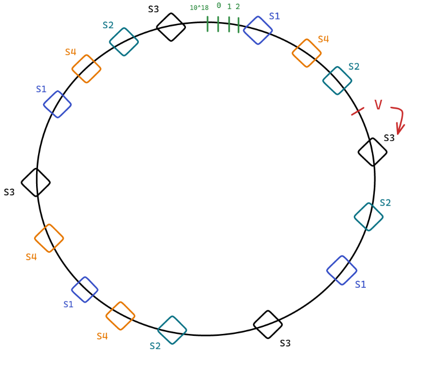
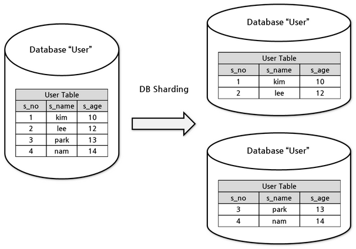
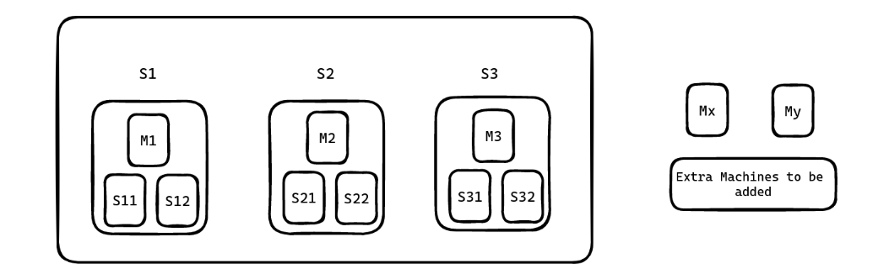
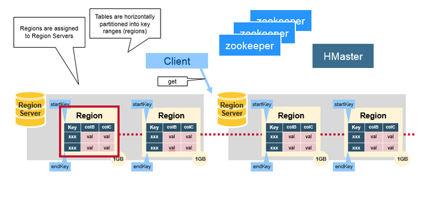
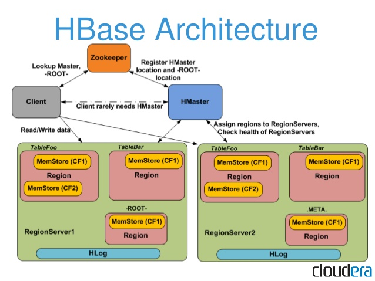
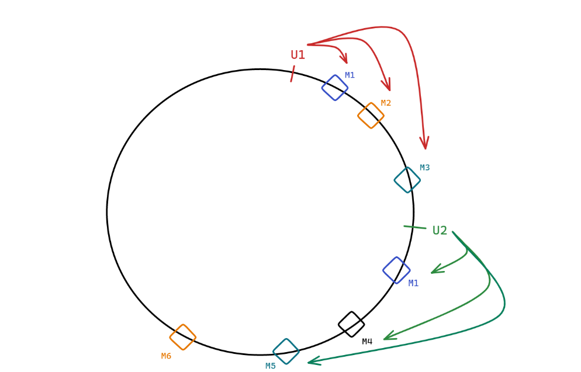

## SQL Databases:

SQL databases are relational databases which consist of tables related to each other and every table has a fixed set of columns. 
We can query across tables to retrieve related information.

_Features of SQL Databases:_
1. Normalization
2. ACID transactions
3. Defined Schema

#### Normalization : 

One of the requirements of SQL databases is to store the data in normalized form to avoid data redundancy and achieve consistency across tables. 
For example, let’s assume two tables are storing a particular score and one of the scores gets changed due to an update operation. 
Now, there will be two different scores at two different tables leading to confusion as to which score should be used.

Hence, the data should be normalized to avoid this data redundancy and trust issue.

#### ACID stands for Atomicity, Consistency, Isolation and Durability.

Atomicity means that either a transaction must be all or none. 
There should not be any partial states of execution of a transaction. 
Either all statements of a transaction are completed successfully or all of them are rolled back.
Consistency refers to the property of a database where data is consistent before and after a transaction is executed. 
It may not be consistent while a transaction is being executed, but it should achieve consistency eventually.
Isolation means that any two transactions must be independent of each other to avoid problems such as dirty reads.
Durability means that the database should be durable, i.e. the changes committed by a transaction must persist even after a system reboot or crash.

Let’s say Rohit wants to withdraw Rs 1000 from his bank account. 

This operation depends on the condition that Rohit’s bank balance is greater than or equal to 1000 INR. 
Hence the withdrawal essentially consists of two operations:
Check if the bank balance is greater than or equal to 1000 INR.
If yes, perform a set operation: Balance = Balance - 1000 and disperse cash.

Now, imagine these operations are done separately in an app server. 
Let’s assume that Rohit’s bank balance is 1500 INR. And the first operation was completed successfully with a yes. 
Now, when the second operation is performed, there are chances that some other withdrawal request of 1000 INR has already changed Rohit’s bank balance to 500 INR.

Now, if the second operation is performed, it would set Rohit’s bank balance to -500 which does not make sense. 
Hence, if the database does not guarantee atomicity and isolation, these kinds of problems can happen when multiple requests attempt to access (and modify) the same node.

Now, when Rohit makes a request to withdraw 1000 INR from his account, both these operations represent a single transaction. The transaction either succeeds completely or fails.
There won’t be any race conditions between two transactions. This is guaranteed by a SQL database.

#### Defined Schema:
Each table has a fixed set of columns and the size and type of each column is well-known. 

### Shortcomings of SQL Db:
1. Fixed Schema might not fit every use case
2. Db sharding nullifies SQL Advantages

##### Fixed Schema might not fit every use case

Let’s design the schema for an ecommerce website and just focus on the Product table. There are a couple of pointers here:

1. Every product has a different set of attributes. For example, a t-shirt has a collar type, size, color, neck-type, etc.. However, a MacBook Air has RAM size, HDD size, HDD type, screen size, etc.
2. These products have starkly different properties and hence couldn’t be stored in a single table. If you store attributes in the form of a string, filtering/searching becomes inefficient.
    However, there are almost 100,000 types of products, hence maintaining a separate table for each type of product is a nightmare to handle.

SQL is designed to handle millions of records within a single table and not millions of tables itself.

Hence, there is a requirement of a flexible schema to include details of various products in an efficient manner.

##### Db sharding nullifies SQL Advantages
If there is a need of sharding due to large data size, performing a SQL query becomes very difficult and costly.
Doing a JOIN operation across machines nullifies the advantages offered by SQL.
SQL has almost zero power post sharding. 
You don’t want to visit multiple machines to perform a SQL query. You rather want to get all data in a single machine.

As a result, most SQL databases such as postgresql and sqlite do not support sharding at all.

Given these two problems, you might need to think of some other ways of data storage. And that’s where NoSQL databases come into the scenario.

## NoSQL Db:
Let’s pick the second problem where data needs to be sharded:
1. First step to Sharding is choosing the Sharding Key. 
2. Second step is to perform Denormalization.

Let’s understand this with the help of an example:

Imagine a community which exchanges messages through a messenger application. 
Now, the data needs to be sharded and let’s choose UserID as the sharding key. 
So, there will be a single machine holding all information about the conversations of a particular user. 
For example, M1 stores data of U1 and M2 for U2 and so on.

Now, let’s say U1 sends a message to U2. 
This message needs to be stored at both M1 (sent box) and M2 (received box). 
This is actually denormalization and it leads to data redundancy.
To avoid such problems and inefficiencies, we need to choose the sharding key carefully.

### What is sharding ?
Sharding is a type of database partitioning that separates large databases into smaller, faster, more easily managed parts. 
These smaller parts are called data shards. The word shard means "a small part of a whole."

Sharding involves splitting and distributing one logical data set across multiple databases that share nothing and can be deployed across multiple servers. 
To achieve sharding, the rows or columns of a larger database table are split into multiple smaller tables.

Types:
1. **Horizontal sharding**:  When each new table has the same schema but unique rows, it is known as horizontal sharding. 
    In this type of sharding, more machines are added to an existing stack to spread out the load, increase processing speed and support more traffic. 
    This method is most effective when queries return a subset of rows that are often grouped together.
   
2. **Vertical sharding**. When each new table has a schema that is a faithful subset of the original table's schema, it is known as vertical sharding. 
    It is effective when queries usually return only a subset of columns of the data.

### Examples of Choosing a Good Sharding Key
1. Banking System

    Situation:
        1. Users can have active bank accounts across cities.
        2. Most Frequent operations:
            Balance Query
            Fetch Transaction History
            Fetch list of accounts of a user
            Create new transactions
> Hence, userId can be a good sharding key

**Why is CityID not a good sharding key?**

    Since users can move across cities, all transactions of a user from the account in city C1 needs to be copied to another account in city C2 and vice versa.
    Some cities have a larger number of users than others. Load balancing poses a problem.

An efficient sharding key is the UserID.

All information of a user at one place. Operations can be performed most efficiently.
For Balance Query, Transaction History, List of accounts of a user, you only need to talk to one machine (Machine which stores info of that user).
Load balancing can be achieved as you can distribute active and inactive users uniformly across machines.

Note: Hierarchical Sharding might not be a great design as if one machine crashes, all machines under its tree also become inaccessible.

2. Uber-like System
Situations:
    Most frequent use case is to search for nearby drivers.

**CityID seems to be a good sharding key.**
You need to search only those cabs which are in your city. Most frequent use cases are handled smoothly.
DriverID is not a good choice as:
The nearby drivers could be on any machines. 
So, for every search operation, there will be a need to query multiple machines which is very costly.
Also sharding by PIN CODE is not good as a cab frequently travels across regions of different pin codes.

Note: Even for inter-city rides, it makes sense to search drivers which are in your city.

3. Slack Sharding Key (Groups-heavy system)
Situation:
    A group in Slack may even consist of 100,000 users.

UserID is not a good choice due to the following reasons:
A single message in a group or channel needs to perform multiple write operations in different machines.

**For Slack, GroupID is the best sharding key**:
    Single write corresponding to a message and events like that.
    All the channels of a user can be stored in a machine. When the user opens Slack for the first time, show the list of channels.
    Lazy Fetch is possible. Asynchronous retrieval of unread messages and channel updates. You need to fetch messages only when the user clicks on that particular channel.
Hence, according to the use case of Slack, GroupID makes more sense.

4. IRCTC Sharding Key:

Main purpose is ticket booking which involves TrainID, date, class, UserID, etc.

Situation:
Primary problem of IRCTC is to avoid double-booked tickets.
Load Balancing, major problem in case of tatkal system.

Date of Booking is not a good Sharding Key:
The machine that has all trains for tomorrow will be bombarded with requests.
It will create problems with the tatkal system. The machine with the next date will always be heavily bombarded with requests when tatkal booking starts.

UserID is not a valid Sharding Key:
As it is difficult to assure that the same ticket does not get assigned to multiple users.
At peak time, it is not possible to perform a costly check every time about the status of a berth before booking. And if we don’t perform this check, there will be issues with consistency.

**TrainID is a good sharding key:**
> Loads get split among trains. For example, tomorrow there will be a lot of trains running and hence load gets distributed among all machines.
    Within a train, it knows which user has been allocated a particular berth.
    Hence, it solves the shortcomings of Date and UserID as sharding keys.

Note: Composite sharding keys can also be a good choice.

#### Few points to keep in mind while choosing Sharding Keys:

1. Load should be distributed uniformly across all machines as much as possible.
2. Most frequent operations should be performed efficiently.
3. Minimum machines should be updated when the most-frequent operation is performed. This helps in maintaining the consistency of the database.
4. Minimize redundancy as much as possible.

### Types of NoSQL databases

#### 1. Key-Value NoSQL DBs
    Data is stored simply in the form of key-value pairs, exactly like a hashmap.
    The value does not have a type. You can assume Key-Value NoSQL databases to be like a hashmap from string to string.
    Examples include: DynamoDB, Redis, etc.

#### 2. Document DBs
Document DB structures data in the form of JSON format.
Every record is like a JSON object and all records can have different attributes.
We can search the records by any attribute.
Examples include: MongoDB and AWS ElasticSearch, etc.
Document DBs give some kind of tabular structure and it is mostly used for ecommerce applications where we have too many product categories.

Link to play with one of the popular Document DBs, MongoDB: MongoDB Shell. It has clear directions regarding how to:
1. Insert data
2. Use find() function, filter data Aggregate data, etc.

#### 3. Column-Family Storage
The sharding key constitutes the RowID. Within the RowID, there are a bunch of column families similar to tables in SQL databases.
In every column family, you can store multiple strings like a record of that column family. 
These records have a timestamp at the beginning and they are sorted by timestamp in descending order.
Every column family in a CF DB is like a table which consists of only two columns: timestamp and a string.
> It allows prefix searching and fetching top or latest X entries efficiently. For example, the last 20 entries you have checked-in, latest tweets corresponding to a hashtag, posts that you have made, etc.

> It can be used at any such application where there are countable (practical) schemas instead of completely schema less

The Column-Family Storage system is very helpful when you want to implement Pagination. 
That too if you desire to implement pagination on multiple attributes, CF DBs is the NoSQL database to implement.

Examples include Cassandra, HBase, etc.
Cassandra
https://cassandra.apache.org/_/cassandra-basics.html
https://cassandra.apache.org/_/case-studies.html
https://cassandra.apache.org/doc/stable/cassandra/architecture/overview.html
https://cassandra.apache.org/doc/stable/cassandra/architecture/guarantees.html
https://cassandra.apache.org/doc/stable/cassandra/data_modeling/intro.html

### Choose a Proper NoSQL DB

Twitter-HashTag data storage
###### **_Situation_**:
With a hashtag, you store the most popular or latest tweets.
Also, there is a need to fetch the tweets in incremental order, for example, first 10 tweets, then 20 tweets and so on.
As you scroll through the application, fetch requests are submitted to the database.

_Key-Value DB is not a good choice_.
The problem with Key-Value DB is that corresponding to a particular tweet(key), all the tweets associated with that tweet will be fetched.
Even though the need is only 10 tweets, the entire 10000 tweets are fetched. This will lead to delay in loading tweets and eventually bad user experience.

**Column-Family is a better choice**
Let’s make the tweet a sharding key. Now, there can be column families such as Tweets, Popular Tweets, etc.
When the posts related to a tweet are required, you only need to query the first X entries of the tweets column family.
Similarly, if more tweets are required, you can provide an offset, and fetch records from a particular point.
Live scores of Sports/Matches

##### **Situation**:
Given a recent event or match, you have to show only the ongoing score information.
Key-Value DB is the best choice
**In this situation, Key-Value DB is the best as we simply have to access and update the value corresponding to a particular match/key.
It is very light weight as well**.
Current Location of Cab in Uber-like Application

##### Situation:
Uber needs to show the live location of cabs. How to store the live location of cabs?

If **location history is needed: Column-Family DB is the best choice**

We can keep the cab as a sharding key and a column family: Location.
Now, we have to simply fetch the first few records of the Location column family corresponding to a particular cab.
Also, new records need to be inserted into the Location column family.

**If location history is not needed: Key-Value DB is the best choice:**
    If only the current location is needed, Key-Value makes a lot more sense.
    Simply fetch and update the value corresponding to the cab (key).

#### Problem

Problem Statement 2
Design a Manual Sharding system which supports:
Adding new shard + data migration
When a machine dies inside a shard, necessary actions are performed to restore the replication level.
The system will keep scaling as new machines will be added.

Design the black box given below.

Your task is to determine how to store data in the memory so that you are able to:
find entries quickly &
support updates

##### Points during questionnaire
> Facebook manually manages sharding in its UserDB which is a MySQL database instance.
    Manual Sharding involves adding a machine, data migration when a new machine is added, consistent hashing while adding a new shard, and if a machine goes down, it has to be handled manually.

> JavaScript developers generally deal with Document DBs pretty easily. JS developers work with JSON objects quite often. 
    Since records in Document DBs are pretty similar to JSON objects, JS Developers find it easy to start with.

> SQL databases are enough to handle small to medium sized companies. If you start a company, design the database using SQL databases. Scaler still runs on (free) MySQL DB and it works perfectly fine. 
> NoSQL is only needed beyond a certain scale.

> ACID is not built-in in NoSQL DBs. It is possible to build ACID on top of NoSQL, however consistency should not be confused with ACID.
ACID features can be implemented on top of NoSQL by maintaining a central shard machine and channeling all write operations through it. Write operations can be performed only after acquiring the write lock from the central shard machine. Hence, atomicity and isolation can be ensured through this system.
Atomicity and Isolation are different from Consistency.
> 

### Choosing a sharding key :
Sharding means that you are dividing data into more than 1 machine because data size is so big that it can't fit in a single machine.
So, we try to divide data into diff machines. But we need to make sure that our queries are never querying more than 1 machine in any case. Becuase that will be a very expensive query and we can't load that much of data in RAM.

Hence we choose a sharding key - to make sure what are the most common use cases

Eg. In above design problem, if we choose first letter of the username, then will it be a good sharding key ?
Lets see the disadvantages :
1. Uneven distribution of load and storage (may be more names starting with 'a' than 'x')
2. Under utilization of resources - skewed table
3. Upper limit of possible shards is defined - there can be no more than 26 shards
4. If no. of users from 'a' becomes too large, we can't shard further

> How to create a system which maintains the replication level (let’s say 3) automatically without you having to intervene?

###### _Solution1_ : If the load on a machine goes beyond a certain threshold, add a new machine and transfer some part of the data to it.
Drawbacks of this solution :
1. Letting the sharding happen at any point in time is not desirable. What if the sharding happens at peak time? It will further degrade the response time.
2. There is a traffic pattern that shows the frequency of user visits against time. It is generally seen that at a particular time, the amount of traffic is maximum, and this time is called **peak time**.
3. In the system speculated above, it is highly likely that the data segregation to another shard will happen at peak time when the load exceeds the threshold.
4. If you are segregating the machine, then you are further adding to the load. Because not only now do you need to handle the peak traffic, but you also migrate data at the peak traffic time.

###### _Solution2_ : Consistent Hashing

> Imagine we have three shards (S1, S2 and S3) and four different hashing functions (H1, H2, H3, H4) which produce output in the range [0, 10^18].

> Determine a unique key for each shard. For example, it could be the IP of one of the machines, etc. Determine the hash values of these shards by passing their unique keys into the hashing functions.

> For each shard, there will be four hashed values corresponding to each hashing function
> Consider the image below. It shows the shards (S1, S2, and S3) on the circle as per their hashed values.
> Let’s assume UserID as the sharding key. Pass this UserID through a hashing function, H, which also generates output in the range [0, 10^18]. Let the output be V.

> Place this value, V in the same circle, and as per the condition, the user is assigned the first machine in the cyclic order which is S3
> 
> Now, let’s add a new shard S4. As per the outputs of hashing functions, let’s place S4 in the circle as shown below.
> The addition of S4 shard helps us achieve a more uniform distribution of storage and load.
> S4 has taken up some users from each of the S1, S2 and S3 shards and hence the load on existing shards has gone down.

Note : Though the illustration has used a circle, it is actually a sorted array. 
In this sorted array, you will find the first number larger than the hashed value of UserID to identify the shard to be assigned.
In the example above, UserID is used as the sharding key. In general, it can be replaced with any sharding key

#### Manual Sharding
Let's create a db called PriDb, which has the following properties:
1. It is entirely empty and consists of shards: S1, S2 and S3
2. Each shard consists of 1 master and 2 slaves
3. Take any sharding key which will be used to route to right shard (this routing is performed by Db Clients running Consistent Hashing Code)
4. Let's assume PriDb is directed to S1. this can use any of 3 machines where read is required
5. However, write behaviour is dependent on what kind of system we wnt to create - highly available system or highly consistent system

##### Open Questions
1. How to implement the ability of adding and deleting machines? Like how should system change when new instances are added ?
2. What happens when a machine dies ?

Consider the following situation: we have two machines Mx and My which are to be added to PriDB.

* What to do with these two machines?
Options:

* > Add them to an existing shard.
* > Keep them in standby mode.
* > Create a new shard.
  > 
##### Using an algorithm
* Define an order of priority as follows:
    * > Maintain the replication level (replace the crashed machines first). We have to first address the issue of under-replication. Reason behind this is we cannot afford the unavailability of the app. (Topmost priority)
    * > Create a new shard
    * > Keep them in standby

* Let’s say we have N new machines and each shard consists of M machines.

  * > Then N % M number of machines will be used for replacing crashed machines to maintain the replication level.
  * > Remaining machines(divisible by M) will be used to create new shards.
    > 

##### Minor modifications
* Let N = 3, M = 3 and currently one machine in S1 has died.
* But according to the algorithm, `N % M = 0` machines are available to replace the dead machine.
* To solve this issue, we can decide a threshold number of machines, X which are always in standby to cater to our topmost priority, i.e. replacing dead machines and regaining replication level. 
* This threshold can be a function of the existing number of shards.
* And from the remaining machines (N - X) we can create new shards if possible

Note: 
> Orchestrator implements these functionalities of maintaining reserve machines and creating new shards with the remaining ones. This Orchestrator goes by various names such as NameNode (Hadoop), JobTracker, HBase Master, etc

##### Utilization of Standby Machines
Contribution to existing shards by being slaves in them (additional replica).
If a slave dies in one shard containing one of these standby machines, you don’t have to do anything as a backup is already there.

Now that we have got an idea of where to use additional machines, let’s answer two questions:
1. How are shards created?
2. What is the exact potential number of reserve machines needed based on the number of shards?

##### Seamless creation of Shards
While adding a new shard, cold start(no data in the begining) is the main problem. Typically, data migration is done in 2 phases:
* Staging Phase
* Real phase

##### Staging Phase
* Nobody in the upper layer such as DB clients knows that there is going to be a new shard.
* Hence, the new shard does not show up in the Consistent Hashing circle and the system works as if the new shard does not exist at all.
* Now, a **Simulation** is executed to determine the **UserIDs** which will be directed to the new shard once it comes online.
* Now, a Simulation is executed to determine the UserIDs which will be directed to the new shard once it comes online.
* This basically determines the hash ranges that would get allocated to the new shard. Along with this, the shards which store those hashes are also determined.
* Now, let’s say Staging phase starts at T1 = 10:00:00 PM and you start copying the allocated hash ranges. Assume at T2 = 10:15:00 PM the copying process is complete and the new shard is warmed up.
* However, notice it still may not have the writes which were performed between T1 and T2.
* For example, if userAA had sent a write request at 10:01:00 PM then it would have gone for shard S1.
* Let’s assume Bx and By bookmarks were added by userAA at 10:01:00 PM. Now, there is no guarantee that these bookmarks have made their way to the new shard.

##### Real Phase

In this phase, the new shard is made live(with incomplete information).

* Hence, we have to catch up with such relevant entries (made between T1 and T2). This catch up is really quick like a few seconds. Let’s say at T3 = 10:15:15 PM, the catch-up is complete.
  * However, at T2 you made S4 live. Now, if userAA again asks for her bookmarks between T2 and T3, there are two choices:

    > Being Highly Available: Return whatever the new shard has, even if it is stale information.
    > Being Highly Consistent: For 15 seconds, the system would be unavailable. However, this is a very small duration (15 mins to 15 seconds downtime).

**Timelines:**
* T1: Staging Phase starts.
* T2: New shard went live.
* T3: Delta updates complete. Missing information retrieved.

After T3, S4 sends signals to relevant shards to delete the hash ranges which are now served by itself (S4). This removes redundant data.

Note: 
> Existing reserved shards are better tied to shards where it came from. Hence, these existing reserved machines could be utilized to create new shards. And the new machines can take up the reserve spot.

##### Estimate of the number of Reserved Machines

* Reserved Machines = X * Number of Shards
* Number of required reserved machines actually depends on the maximum number of dead machines at a time.
* Maximum number of dead machines at a time depends on various factors such as:
  * quality of machine used
  * average age of machines
* Now, the approach to determine this number is to calculate
  * the probability of failing X machines simultaneously
  * Expected number of machines dead at the same time
* There is another approach to this problem: Multi-master approach deployed by DynamoDB, Cassandra, etc.

##### Multi master approach

Consider a system of multi-master machines i.e. every machine in the system is a master. There is no slave. 
In the Multi-Master system, there is no need for reserved machines. 
Every single machine is a master, and it is brought to the consistent hashing circle as and when it is live.

Master machines M1, M2, M3, etc. are shown in the Consistent Hashing circle.

* Now, let’s say replication level = 3. Imagine a user U1 as shown below. Since you want to maintain three replicas, what are the optimal two machines where you should put bookmarks of U1?
* If M1 dies and U1 makes a request, which machine gets U1’s request? M2 right. Hence, it would be better if M2 already had the second replica of U1’s bookmarks.
* Finally, the third replica of U1 should be in M3 so that even when both M1 and M2 die, there is no struggle to find U1 data, it’s already in M3.
* Remember, M2 should have a replica of only U1's bookmarks and not a complete replica of M1. Similarly, for M3.
* To complete, U1’s second replica should be in M2 and third replica should be in M3.
* Similarly, U2’s second replica should be in M4 and third replica should be in M5.
So, it makes sense that for a user, the three replicas should be in the next three unique machines in cyclic order.

##### Read(R) , Write(W) Operations
In multimaster, we can have tunable consistency. We can configure two variables: R and W.
R represents the minimum number of read operations required before a read request is successful.
W represents the minimum number of write operations required before a write request is successful.
Let X be the replication level. Then R <= X and W <= X.
> When R = 1 and W = 3, it is a highly consistent system.
    Till all the machines are not updated, a write operation is not considered successful. Hence, highly consistent.
    Even if one of these machines is taking time to respond or not available, writes will start failing.

> If R = 1 and W = 1, it is a highly available system.
    If a read request arrives, you can read from any of the machines and if you get any information, the read operation is successful.
    Similarly, if a write request arrives, if any of the machines are updated, the write operation is considered successful.
    After the successful update of any one machine, other machines can catch up using the Gossip protocol.
    This system may be inconsistent if a read request goes to a non-updated machine, we may get non-consistent information.
> 
> In general : As you increase R + W, Consistency increases.
> Lower R + W => Lower Consistency, Higher R + W => Higher Consistency.
> If R + W > X, you have a highly consistent system.

Because by just changing R and W it is possible to build a highly consistent or available system, it is also called tunable consistency.

##### How a transaction is carried out between two bank accounts and how actually it is rolled back in case of failure?
Ans: Such a transaction between two bank accounts has states. For example, let A transfers 1000 INR to B. When money has been deducted from A’s account, the transaction goes to send_initiated state (just a term). 
In case of successful transfer, the state of the A’s transaction is changed to send_completed.
However, let’s say due to some internal problem, money did not get deposited into B’s account. 
In such a case, the transaction on A's side is rolled back and 1000 INR is again added to A’s bank balance. 
This is how it is rolled back. You may have seen that money comes back after 1-2 days. 
This is because the bank re-attempts the money transfer. 
However, if there is a permanent failure, the transaction on A’s side is rolled back.
